# 广州 · 三维实景城市

**在线体验 → <https://tsdsj.github.io/guangzhou-3d/>**（电脑与手机浏览器均可，需支持 WebGL2；首次加载约 7 MB）

在浏览器中实时渲染的广州中心城区三维模型。**道路、建筑、水系、铁路与地形来自真实公开数据**
（OpenStreetMap 2026-09 快照 + SRTM 高程），范围西起芳村、东至琶洲会展中心、北抵广州火车站和天河北、
南达海珠中部，约 17.2 × 7.4 km。OSM 缺失的细节用程序化方式补齐：立面、骑楼廊道、屋顶设备、
未测绘街区的填充建筑、行道树、车流、列车与游船。界面只有预设场景——12 个航拍 / 全景 + 7 个人眼高度的街景漫步。

纯前端、零构建步骤：没有打包工具，也不需要 `npm install`，整个站点就是静态文件。

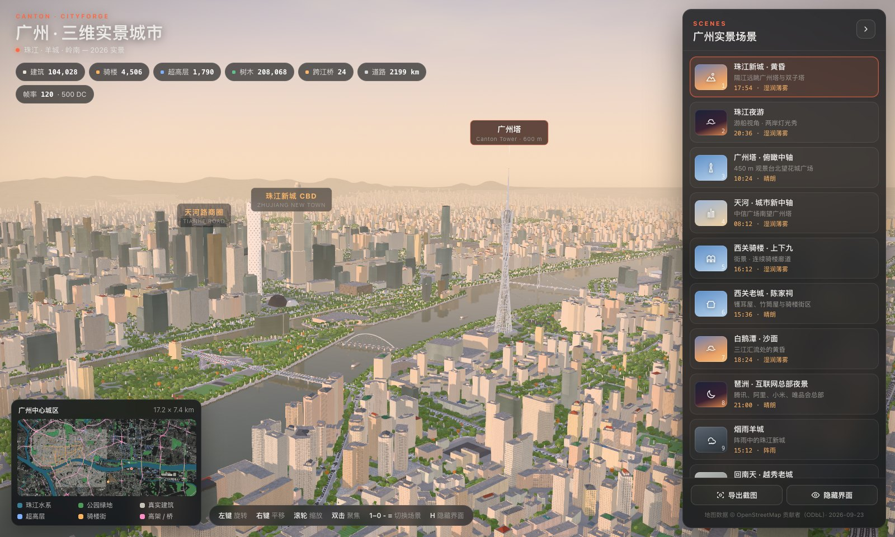
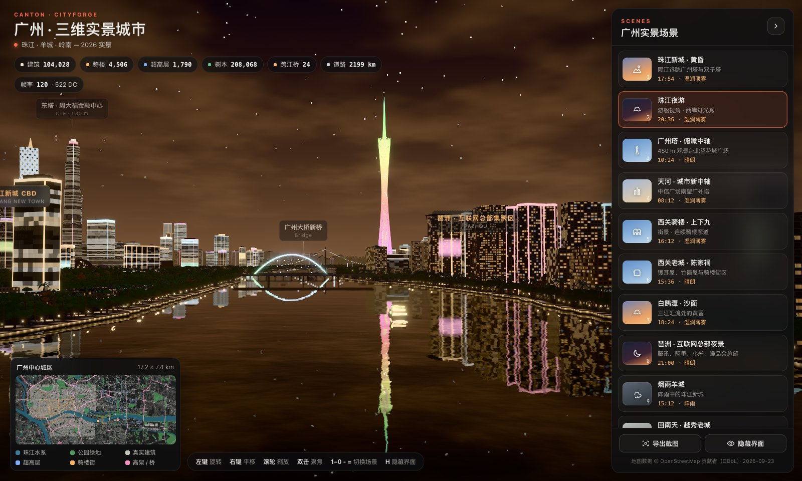

| 广州塔 · 俯瞰中轴 | 西关骑楼 · 上下九 |
| --- | --- |
| 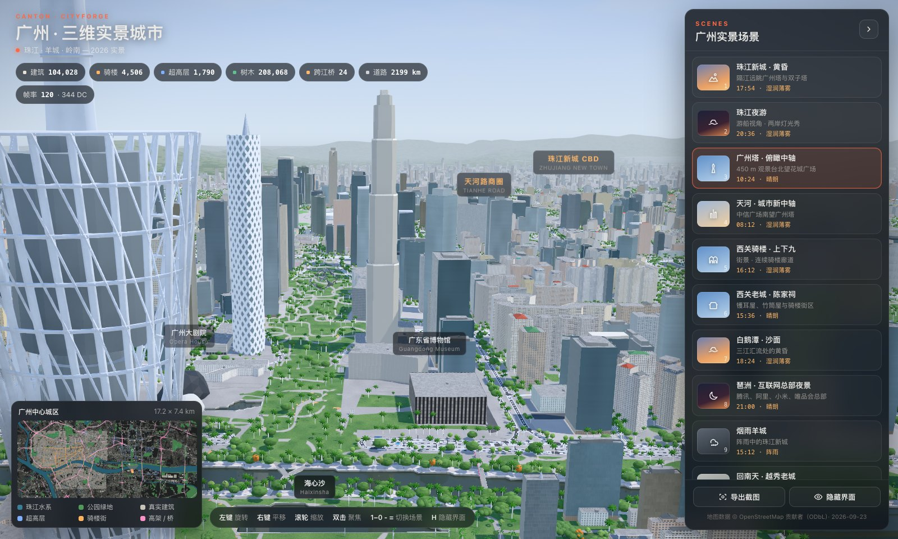 | 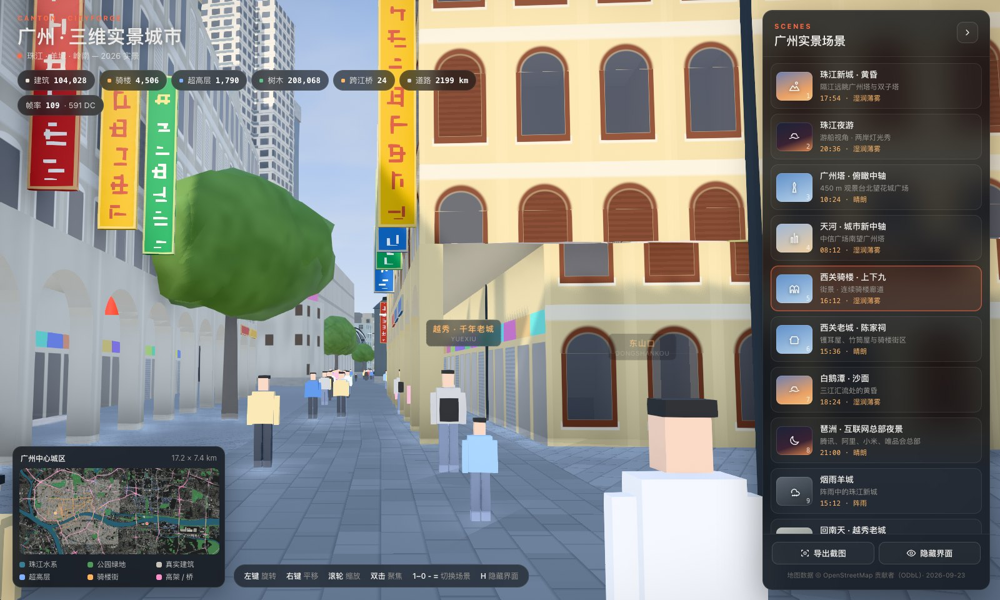 |
| **西关老城 · 陈家祠** | **城市俯视** |
| 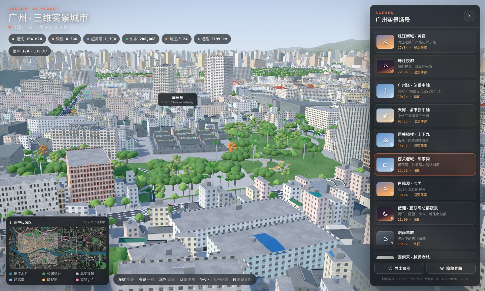 | 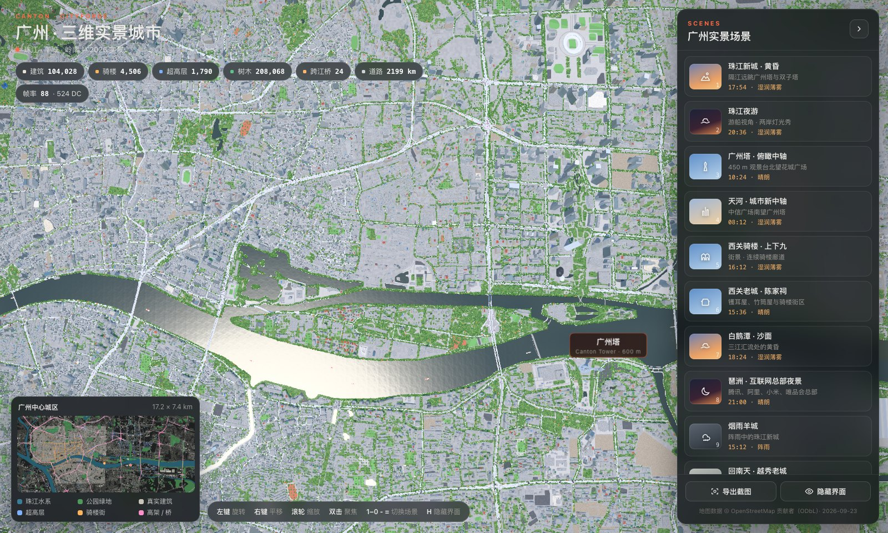 |
| **琶洲 · 互联网总部夜景** | **天河 · 城市新中轴** |
| 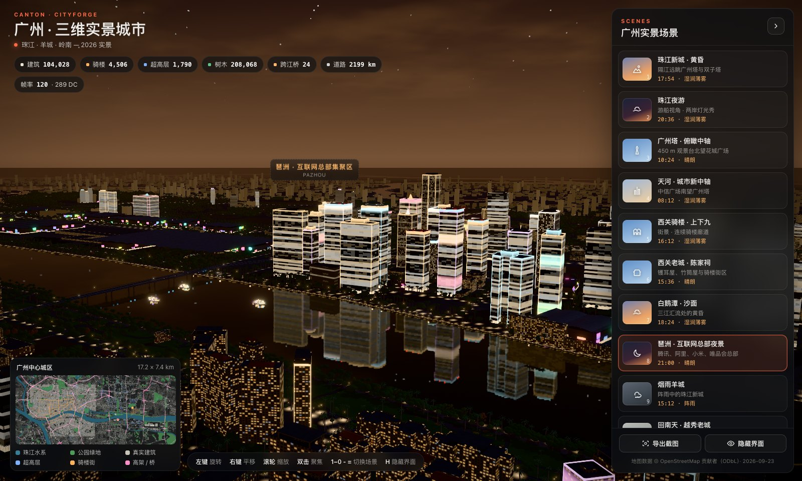 | 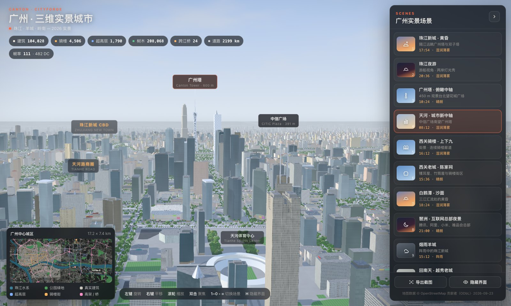 |
| **白鹅潭 · 沙面** | **回南天 · 越秀老城** |
| 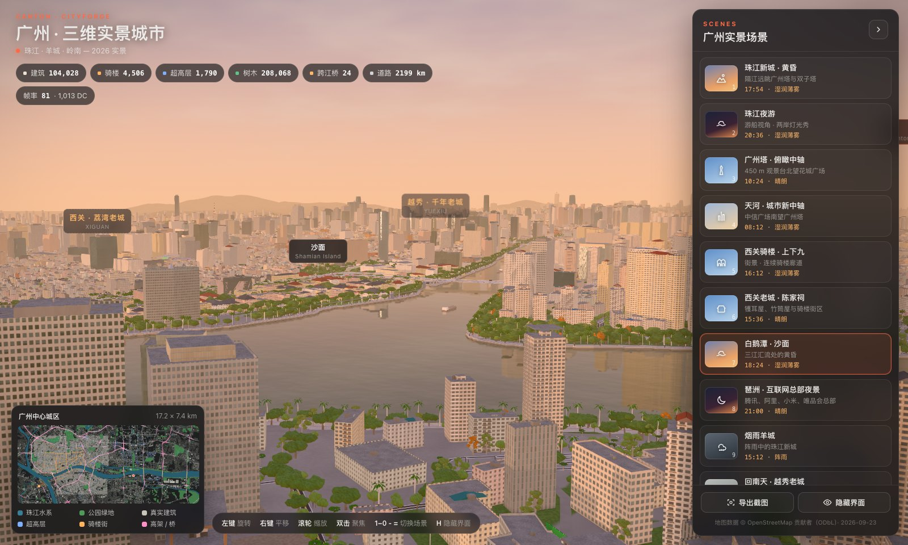 | 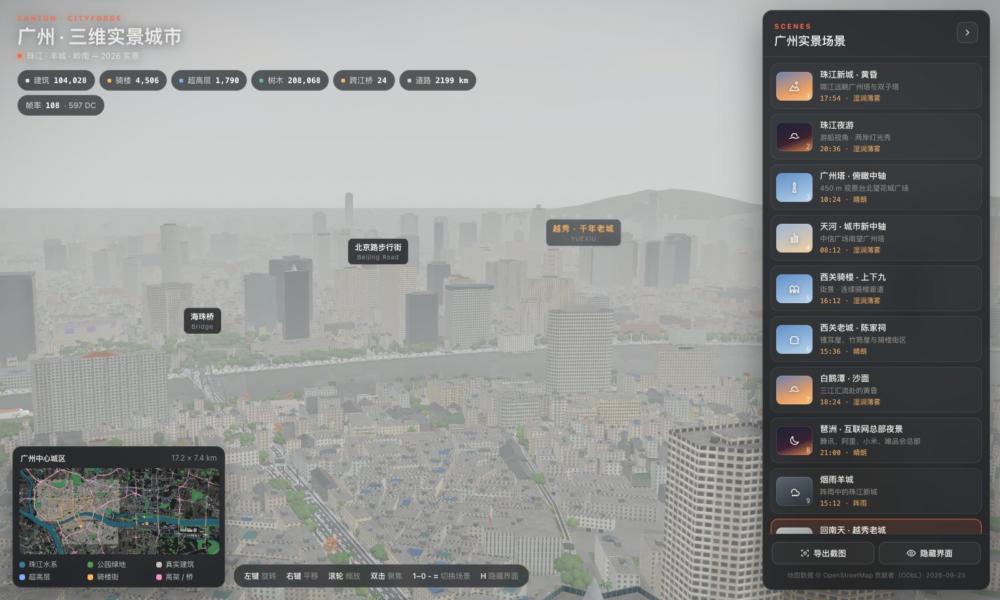 |
| **北京路步行街（街景）** | **阅江西路 · 江岸夜色（街景）** |
| 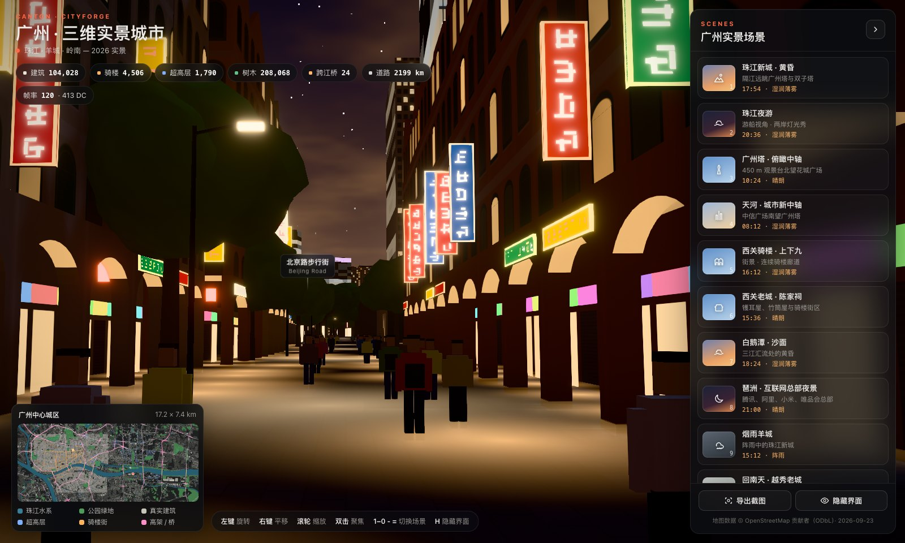 | 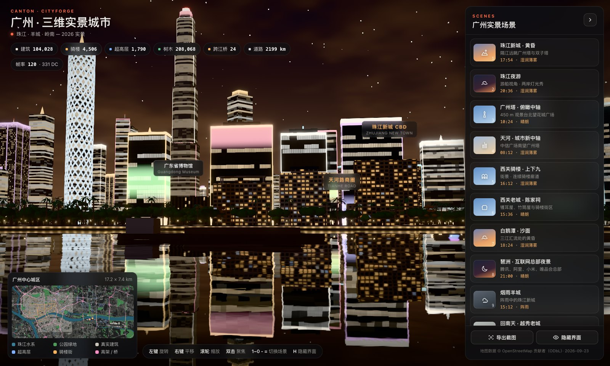 |

## 运行

无需安装，依赖已内置在 `vendor/`，通过 `index.html` 的 import map 加载：three.js 0.185.1、pmndrs/postprocessing 6.39.4、N8AO 2.0.1。
城市数据已预先构建在 `data/`（gzip 压缩后约 7 MB，首屏与植被分两段加载，由页面用浏览器自带的 `DecompressionStream` 解压，
因此放到任何静态托管上都只传输压缩体积）。需要支持 WebGL2 的现代浏览器。

```bash
npm start
```

启动后访问 <http://localhost:5173>，也可以用 `node serve.mjs 8080` 指定端口。
直接用 `file://` 打开 `index.html` 时，浏览器会拦截 ES 模块和数据请求，必须通过本地服务器访问。

操作方式：
- 左键旋转，右键平移，滚轮缩放（缩放到光标处），双击聚焦地面点；
- `1`–`9`、`0`、`-`、`=` 依次切换前 12 个场景，`H` 隐藏界面；面板下方还有 7 个街景漫步场景；
- 手机上单指旋转、双指缩放与平移，场景卡片在底部横向滑动；
- 地址栏 `#scene=qilou` 直接打开指定场景；手动浏览停下后地址栏自动变成 `#cam=经,纬,高,…`，复制链接即可分享当前视角；
- 点击小地图可飞到该位置；
- 闲置 60 秒进入展示模式，自动轮播各场景（任意操作退出；系统开启“减少动态效果”时不自动飞行）。

## 预设场景

| # | 场景 | 时间 · 天气 | 机位 |
| --- | --- | --- | --- |
| 1 | 珠江新城 · 黄昏 | 17:54 湿润薄雾 | 海珠区江边远眺广州塔、双子塔、花城广场 |
| 2 | 珠江夜游 | 20:36 | 游船高度沿前航道缓慢巡航，两岸灯光秀与桥梁灯带 |
| 3 | 广州塔 · 俯瞰中轴 | 10:24 晴 | 450 m 观景台北望海心桥、花城广场、天河体育中心 |
| 4 | 天河 · 城市新中轴 | 08:12 晨雾 | 中信广场上空南望整条新中轴 |
| 5 | 西关骑楼 · 上下九 | 16:12 | 街景高度，自动选择骑楼最连续的步行街段 |
| 6 | 西关老城 · 陈家祠 | 15:36 晴 | 陈家祠广场、荔湾老城、竹筒屋街区 |
| 7 | 白鹅潭 · 沙面 | 18:24 | 三江汇流处与沙面岛 |
| 8 | 琶洲 · 互联网总部夜景 | 21:00 | 琶洲西区总部群、广交会展馆、琶洲塔 |
| 9 | 烟雨羊城 | 15:12 阵雨 | 雨中的珠江新城（三维雨丝、湿润路面、江面雨点） |
| 10 | 回南天 · 越秀老城 | 10:24 回南天 | 海珠桥北望北京路、起义路一带 |
| 11 | 城市俯视 | 12:48 | 7 km 高空俯瞰珠江穿城而过的整体格局 |
| 12 | 电影漫游 · 一江两岸 | 19:06 | 沿珠江从白鹅潭飞往琶洲的镜头路径 |
| — | 街景漫步 × 7 | | 北京路步行街、沙面大街、永庆坊 · 恩宁路、花城广场、阅江西路江岸、二沙岛江畔、天河路商圈，均为 1.75 m 人眼高度（机位自动避开树冠与灯柱） |

## 真实数据

| 数据 | 来源与处理 |
| --- | --- |
| 建筑 | OSM `building` 与 `building:part` 共 19,823 栋，使用真实轮廓（含内庭院）。有 `height` 或 `building:levels` 标签时用真实高度（办公楼 3.9 m/层，住宅 3.0 m/层）；缺失时取周边 250 m 同尺寸建筑的高度中位数，再退回按类型的默认层数。带 `building:part` 的建筑（如广州东塔）以分段体量替代外轮廓 |
| 道路 | OSM `highway` 共 12,714 条、2,199 km，按真实等级、`lanes`、`oneway`、`bridge`、`layer` 建模。车道数决定路宽和标线，单行道只画单向车流；内环路等高架按 `layer` 与相邻节点抬升，并做引道坡度平滑 |
| 铁路 | OSM `railway`（rail / light_rail / subway / tram 的地面与高架段）共 567 股道约 200 km：广州站、广州东站站场，广深线、京广线与跨江铁路桥。碎石道床、轨枕与钢轨由着色器绘制，干线有接触网立柱；动车组、地铁与有轨电车列车沿线路往返行驶 |
| 地形 | 高程来自 AWS Terrain Tiles（SRTM 等公开 DEM）。越秀山按 OSM 公园与山林轮廓取去噪后的 DEM 抬升（镇海楼一带约 30–45 m，山上的道路、建筑、树木随之贴地）；城区以北的白云山、瘦狗岭一线作为远山出现在天际线上（摩星岭约 380 m） |
| 珠江水系 | OSM `natural=water` / `waterway=riverbank` 多边形，栅格化为双层有符号距离场（内层 6 m、外层 24 m 精度）。水面、堤岸、滨江步道和江面倒影都由它驱动 |
| 跨江桥梁 | 沿道路检测跨越主航道的路段，再按位置聚类，共 24 座。**桥面高度与结构形式**按公开资料建模：海印大桥（双塔单索面斜拉）、海珠桥（三跨下承钢拱）、解放大桥（钢管拱）、琶洲大桥（V 形墩）、鹤洞大桥（双塔斜拉）、珠江大桥（钢桁架）、猎德大桥（贝壳形独塔）；其余为连续梁桥。**海心桥**为倾斜白色钢拱人行桥 |
| 地块 | 公园、绿地、广场、校园、医院、停车场、运动场、林地等 OSM 用地多边形，分类着色，公园内生成蜿蜒步道 |
| 骑楼街 | 按广州骑楼街名录（上下九、第十甫、恩宁路、人民路、一德路、北京路、中山四–七路、长堤大马路、解放路、海珠中路等 50 余条）匹配 OSM 道路名，沿街建筑的首层自动退后为骑楼廊道 |
| 地标 | 按 OSM 要素定位：广州塔、广州国际金融中心、广州周大福金融中心、中信广场、广州大剧院、广东省博物馆、广州图书馆、天河体育中心、陈家祠、六榕寺花塔、琶洲塔、中山纪念堂、石室圣心大教堂、镇海楼、广州电视塔、海心桥、广交会展馆等 |

OSM 覆盖不完整的街区（部分西关、越秀、海珠老城区和住宅区）由程序化方式补齐：
沿真实街道按街巷等级排布临街地块（老城为窄面宽、四进深的竹筒屋、骑楼与砖楼，新区为板楼与塔楼），街区内部按网格补足，
所有填充地块都避开真实建筑、道路、铁路、水体和绿地，共 84,205 个。树木约 20.8 万棵（行道树、中央分隔带、公园、滨江与小区）。

地图数据 © [OpenStreetMap](https://www.openstreetmap.org/copyright) 贡献者，按 ODbL 授权使用，快照时间 2026-09-23；
高程数据来自 [AWS Terrain Tiles](https://registry.opendata.aws/terrain-tiles/)（Tilezen/Mapzen terrarium，含 SRTM 等公开数据）。

### 重新构建数据

```bash
npm run fetch:osm
```

```bash
npm run build:data
```

- `tools/fetch-osm.mjs` 通过 Overpass API 下载 OSM 原始数据到 `data/raw/`（约 31 MB，需要外网与 Node 18+）；高程 `data/raw/dem.*` 已随仓库提供（重新获取见 `tools/terrain.mjs` 开头的说明，来源为 AWS Terrain Tiles z13 瓦片）。
- `tools/build-city.mjs` 离线处理，耗时约 8 秒：投影、水系距离场、道路分级与纵断面、桥梁识别、铁路、地形抬升、建筑高度推断与风格分配、骑楼判定、填充地块、树木 / 路灯 / 游船航线，最后量化并以 gzip 写出。
- 输出 `data/guangzhou.json`（元数据）、`guangzhou.bin.gz`（首屏：水系 / 道路 / 建筑 / 地块 / 铁路 / 地形）、`guangzhou-veg.bin.gz`（树木 / 路灯 / 灯光投影，首屏之后加载）。原始 26.5 MB，压缩后 6.8 MB。
- 数据记录的字段定义在 `src/world/schema.js`，构建端与运行端共用；小整数与颜色量化为 Int16 / Uint8 存储。
- 加 `--debug` 输出平面检查图，`--out <目录>` 指定输出位置。

### 测试

```bash
npm test
```

`tests/build.test.mjs` 重新运行构建并与 `tests/build.snapshot.json` 的输出哈希对比（构建是确定性的），
同时校验仓库里的 `data/` 与当前代码一致。有意修改构建逻辑后用 `UPDATE_SNAPSHOT=1 npm test` 更新快照。

## 建模细节

- **建筑立面**：
  - 全部建筑共用一个程序化立面着色器，每栋建筑的风格、配色、层高、开间、亮灯率等参数存放在数据纹理里，按建筑 ID 读取。
  - 风格包括玻璃幕墙、竖向肋、钻石斜交网格（西塔）、石材、砖楼、骑楼、老式住宅、城中村握手楼、商铺底层等。
  - 近景窗户带室内映射（后墙、天花灯盘、家具剪影、窗帘），远景逐级退化为逐窗、逐层与区域亮度，避免摩尔纹。
- **屋顶**：
  - 按建筑尺度生成女儿墙、楼梯间、水箱、空调外机阵列、冷却塔、蓝色铁皮加建、屋顶招牌、擦窗机轨道、冠顶机房与桅杆，部分屋面为屋顶花园。
  - 老城区是灰瓦双坡与四坡屋面，住宅塔楼带收顶造型。
- **骑楼**：首层退后 3.2 m 形成廊道，廊柱、拱券、廊顶底面、铺面和招牌齐全；廊下有行人往来。
- **地标**：
  - 广州塔：24 根倾斜立柱构成扭转网格，夜间 LED 渐变。
  - 东塔：四段收分，白色竖肋。
  - 西塔：斜交网格。
  - 大剧院：双砾石。
  - 其他：中信广场双天线、广交会展馆波浪屋面、中山纪念堂蓝色琉璃八角攒尖顶、石室双尖塔、镇海楼五层重檐、陈家祠三路三进、六榕花塔、琶洲塔。
- **桥梁与高架**：
  - 按桥型生成主塔、拉索、拱肋、吊杆、桁架和桥墩，夜间有分色灯带。
  - 高架有箱梁、护栏、簕杜鹃花槽、LED 灯带和桥墩；铁路高架有箱梁、挡墙与桥墩。
- **街道**：
  - 路面按车道数绘制车道线、中央双黄线、单行箭头、停止线和斑马线。
  - 主要路口有红绿灯杆，沿街有路灯。
  - 树种有榕树、大王椰、蒲葵、木棉（部分开红花）、樟树；花城广场等 CBD 广场公园为大草坪 + 稀疏棕榈。
- **车流、列车与游船**：
  - 车辆在真实车道上行驶：双向道路靠右，单行道单向，高架与跨江桥按纵断面行驶；车型有轿车、SUV、公交和货车。
  - 动车组（白身蓝腰线）、地铁（红腰线）与有轨电车沿真实线路往返，到达端点停站折返。
  - 游船沿珠江主航道航行。

## 渲染与性能

- **画质档位**：渲染分辨率按约 250 万像素的预算自动决定（4K 外接屏不再按固定像素比渲染），持续低帧率时逐档降低分辨率、倒影、后期与绘制距离，帧率富余时回升；每个场景记住跑不动的档位。手机与集成显卡从低档起步，最低档缩短树木与小构件的绘制距离。
- **后期管线**（`src/scene/post.js`）：HDR → N8AO 环境光遮蔽（高空自动关闭）→ SMAA → 泛光 → 暖调 → PBR Neutral 色调映射 → 暗角。
- **大气**：高度雾、远景雾带、天气（晴 / 湿润薄雾 / 阵雨 / 回南天）和昼夜光照；远山在雾中保留淡淡轮廓。
- **阴影**：两级阴影贴图——远级（4096²）跟随视角中心，近级（2048²）覆盖相机前方给街景高精度阴影；按需分帧重绘，中心按贴图像素对齐避免边缘抖动。
- **树木三级 LOD**：相机 170 m 内换高精度树冠，900 m 内画三维低模（700 m 分块视锥剔除），之外是每棵 2 个三角形的公告板（2.8 km 分块合并，远处树冠保持约 2.6 像素宽避免闪烁）。
- **按距离绘制**：车辆近处画精细模型、远处换盒体车；行人、屋顶小设备、招牌、路灯、信号灯只在数百米内绘制；江面倒影在视野内没有水时整个跳过。
- **合批**：建筑按 1 km 分块合并，落地体块用无底面单元几何；高架与铁路按 3 km 分块。
- **实测**（Apple M5 Pro，1440 × 900）：11 个航拍场景 67–120 fps（多数满帧 120），绘制调用 285–765 次，每帧 110–340 万三角形；优化前同机位为 46–107 fps、520–1180 万三角形。城市在浏览器中组装约 0.6 s，首屏数据 5 MB（gzip）。

## 结构

```
index.html              页面（import map 指向 vendor/）
serve.mjs               零依赖静态服务器（本地预览用；线上为 GitHub Pages）
data/                   构建好的城市数据；raw/ 为 OSM 原始下载与 DEM
tools/fetch-osm.mjs     Overpass 数据下载
tools/build-city.mjs    离线构建主流程
tools/terrain.mjs       地形：越秀山与远山（DEM 去噪、山体范围）
tools/rail.mjs          铁路股道与列车线路串链
tools/lib.mjs           投影、多边形、栅格与距离变换工具
tests/build.test.mjs    构建输出哈希快照测试
src/main.js             加载、场景切换、镜头、渲染循环、画质档、视角分享、展示模式
src/core/scenes.js      19 个预设场景（经纬度机位 + 时间 / 天气）
src/world/schema.js     数据记录字段与量化定义（构建端 / 运行端共用）
src/world/data.js       数据解码与分段加载
src/world/geo.js        水系距离场与地形高度查询
src/world/terrain.js    地形网格（近处 30 m / 远处 90 m）
src/world/buildings.js  OSM 建筑轮廓挤出（骑楼退廊、女儿墙、屋顶）
src/world/parts.js      实例化构件：填充地块、骑楼、屋顶设备、地标、信号灯
src/world/infra.js      路面、高架、跨江桥、海心桥、铁路
src/world/traffic.js    车道与行人路径
src/world/city.js       组装整座城市、LOD 与距离剔除
src/scene/              大气、材质与立面着色器、水面倒影、地标、雨、车流与列车、后期
src/ui/                 场景面板、统计与小地图、镜头控制
vendor/                 three.js、postprocessing、n8ao
```

## 部署

站点是纯静态文件，仓库根目录即站点根目录。GitHub Pages 选择 “Deploy from a branch → main / (root)” 即可；
根目录的 `.nojekyll` 让 Pages 原样发布所有文件。其他静态托管（Nginx、Cloudflare Pages、对象存储等）同理，无需任何服务端配置。

## 已知局限

- 未标注高度的建筑（约占 OSM 建筑的七成）使用推断高度，个别建筑会与实际不符。
- 填充地块是按街区规则生成的，不代表真实的每一栋建筑。
- 立面是程序化风格，不是真实照片纹理。
- 越秀山高度来自去噪后的公开 DEM，为近似形状；广州圆大厦、大学城等在数据范围之外。
- 手机与集成显卡会自动使用较低画质档；较旧的手机可能帧率偏低。

## 参考资料

- OpenStreetMap / Overpass API：<https://www.openstreetmap.org/>、<https://overpass-api.de/>
- 高程：[AWS Terrain Tiles](https://registry.opendata.aws/terrain-tiles/)（Tilezen terrarium）
- 广州骑楼街：<https://zh.wikipedia.org/zh-cn/广州骑楼>、<https://www.gz.gov.cn/zlgz/whgz/content/post_8564096.html>
- 跨江桥梁：
  - [海印大桥](https://zh.wikipedia.org/zh-hans/海印大桥)
  - [华南大桥](https://zh.wikipedia.org/zh-hans/华南大桥)
  - [人民桥](https://zh.wikipedia.org/zh-hans/人民桥_(广州))
  - [解放大桥](https://zh.wikipedia.org/zh-hans/解放大桥_(广州))
  - [江湾大桥](https://zh.wikipedia.org/wiki/江湾大桥_(广州))
  - [琶洲大桥](https://baike.baidu.com/item/琶洲大桥/342433)
- 琶洲互联网总部集聚区：<https://gzdaily.dayoo.com/h5/html5/2023-05/10/content_871_824915.htm>

## 许可与署名

- 代码：[MIT](LICENSE)。
- 地图数据：© [OpenStreetMap](https://www.openstreetmap.org/copyright) 贡献者，[ODbL 1.0](https://opendatacommons.org/licenses/odbl/1-0/)。`data/` 下的城市数据是由 OSM 派生的数据库，同样按 ODbL 提供。
- 高程数据：[AWS Terrain Tiles](https://registry.opendata.aws/terrain-tiles/)（Tilezen/Mapzen，含 SRTM 等公开数据），署名要求见 [Tilezen 说明](https://github.com/tilezen/joerd/blob/master/docs/attribution.md)。
- 第三方库：three.js（MIT）、postprocessing（Zlib）、N8AO（CC0），许可文件见 `vendor/` 各目录。

本项目的代码与文档由 [Claude Code](https://claude.com/claude-code) 编写。
