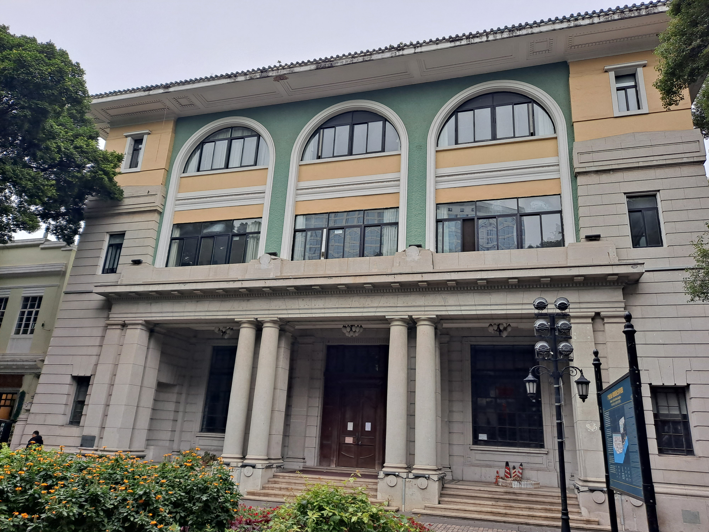

# P3：C02双柱与左翼修正

日期：2026-09-26。[查看C02](http://localhost:5174/prototypes/p2/#C02)。本轮取得更清楚的2021正面照片和铭牌，修正上一版把双柱简化成单柱的问题，并补左翼三个窗口。尚未接入主城。

## 新依据与修改

2021-12-28照片可辨：入口内侧为两组双圆柱（共4根），外侧为两组双方柱（共4根）；左翼三层矩形窗、中央木门也可见。上一版仅有2根圆柱和2根方柱，本轮依据照片改为成对布置，补各自柱础和柱头，门面采用木色简化。

新增左翼开口也来自该照片，不是因为立面对称就复制。其高度和大小暂沿用对齐楼层的比例参数，仍待量测。侧后墙、完整屋顶维持灰色简化。



照片：钉钉，2021-12-28，[原始页面](https://commons.wikimedia.org/wiki/File:Former_US_Consulate_Building.jpg)，[CC BY-SA 4.0](https://creativecommons.org/licenses/by-sa/4.0/)，原图未修改。相同作者日期的[铭牌照片](https://commons.wikimedia.org/wiki/File:Former_US_Consulate_Building_Tablet.jpg)明确给出沙面大街56号、美国领事旧馆和正金银行旧址的对应，也描述南立面五开间。

铭牌补强身份和面向判断，但不含米制高度、廊深或柱距。身份核查层新增该来源，照片仍保留`pixelRegistrationVerified=false`和现状待核状态；原OSM描述未改。

## 保留的估计

- 总高16.4m、廊深2.2m未变。
- 圆柱对中心间距0.80m、方柱对中心间距0.68m为展示估计，柱径、柱础尺寸和分组位置也是比例参数。
- 左翼窗口尺寸及中央门板细节尚未做照片校准；木色不代表精确材质采样。
- 2021与2023照片分别保留日期，不能作为同一时点的完整2026模型。

P2照片增加到3张：2021正面、原2023照片、2021铭牌。默认展示更清楚的2021照片，支持原有照片切换和放大查看。

## 排除记录

定向检索同时检查两张2012照片，它们拍的是相邻汇丰银行（54号），不用于C02柱廊、左翼或尺寸。第三张同组照片请求返回HTTP 429，未立即重试，也未作视觉核查。相关来源、哈希和采用/排除结论保留在[photos.json](research/p3-c02-corner/photos.json)。Commons搜索和imageinfo响应另存同目录，避免仅凭“沙面银行”或“领事馆”题名混配建筑。

本轮新增采用照片均为自由许可，未把无许可确认的媒体图片打包到页面。

## 验证

- 62项项目测试通过，0失败、0跳过。新增回归检查实际8个柱位有网格、左翼三个墙洞贯通，并限制高度/廊深不因新增照片被自动改变。
- 身份候选生成器重跑，通过源快照和照片哈希检查；原4个基础城市文件及3个现有精细参数包不变。
- 实际桌面检查入口双柱、完整正面、三张照片切换与铭牌显示；没有console error/warn。页面布局未改，本轮没有新增手机性能结论。
- [验证记录](research/p3-c02-corner/validation.json)

复现：

```sh
.research/p0-2026-09-25/.venv/bin/python tools/build-c02.py
.research/p0-2026-09-25/.venv/bin/python tools/screen-building-candidates.py
npm test
```

## 下一步

对现有5个建筑样件（B1/B2/B3/C01/C02）及S1连廊做统一尺度与落位预检，核对源控制点、坐标朝向、地面/主体基准、构件越界及遮挡关系。分开记录软件几何问题和外部资料缺口，明确主城接入条件；没有依据的绝对高度不在预检中自动“校准”。本轮不再增加装饰细节或扩展新建筑数量。
