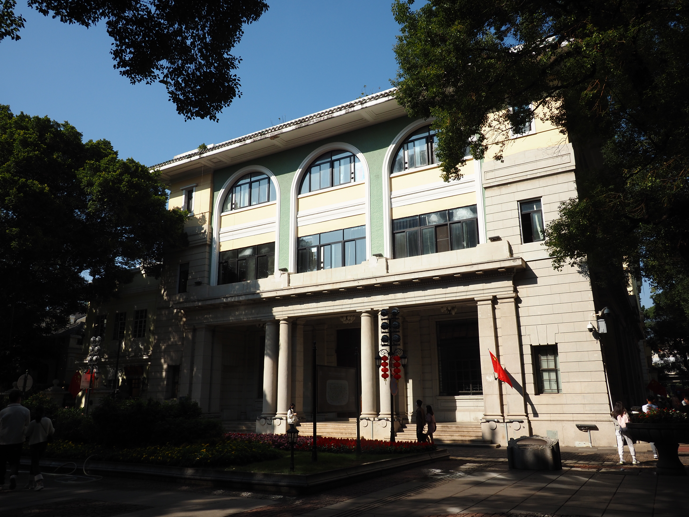

# P3：C02正金银行旧址独立正面样件

日期：2026-09-26。[打开C02](http://localhost:5174/prototypes/p2/#C02)。本轮在P2新增第7个样件，没有加入主城精细替换。

## 已建立的结构

- 中部三大拱跨越二、三层，墙体真实开洞；洞内玻璃与层间实心窗下墙分别后退处理。
- 首层两根可见圆柱、两侧方柱及檐带，入口背墙与外侧柱列之间有实际深度。
- 右侧照片可见的三层矩形窗；正面檐口与窄瓦沿按比例简化。
- 左翼被树木遮挡处、两侧墙、后墙和完整屋顶保持灰色简化，未从右侧复制对称立面。
- 四个平面控制点对应`osm:w352610288`源轮廓；节点线位可叠加检查。



照片：古海岸遗址，2023-01-07，[原始页面](https://commons.wikimedia.org/wiki/File:Guangzhou_Liwan_Shamian_ZhengJin_Yinhang_Jiuzhi_20230107.141132.jpg)，[CC BY-SA 4.0](https://creativecommons.org/licenses/by-sa/4.0/)。使用未修改原图，未生成或贴用推造的背面照片。

## 后续修正

[双柱与左翼修正](P3-C02双柱与左翼修正-2026-09-26.md)已完成：2021新照片支持4根圆柱、4根方柱及左翼三个窗口。上文为首版范围；高度与廊深未改变。

## 精度边界

源轮廓约23.36×35.40m。它是OSM计算值，不是独立测量；照片尚未完成像素配准，南侧正面与源边的对应仍是推定。

总高16.4m、首层檐带5.8m、入口后退2.2m、拱宽、柱距、窗格及台阶全部为展示估计。照片能支持结构关系，不能证明这些米制尺寸。`measuredHeightM=null`、`heightStatus=estimated`、`productionEligible=false`保留在样件数据中。

身份沿用[上轮核查](P3-C02身份与源轮廓核对-2026-09-26.md)：沙面大街56号正金银行旧址，美国领事馆旧馆为历史别名；亚细亚火油描述没有用于建模。现有照片拍摄于2023年，未据此声称2026年的完整现状。

## 实现与验证

独立文件为`prototypes/p2/c02.js`、`c02.json`和`tools/build-c02.py`。复用现有plan-fit、墙洞、材质批处理与P2查看器。生产模型入口和精细替换清单没有注册C02。

- 61项项目测试通过，0失败、0跳过；新增3项覆盖源控制点、身份/未知高度、三拱和后退入口的真实开洞、拱肩和背面实墙、有限网格及照片年代。
- 实际桌面检查转角、入口细部、未知后面、证据着色、C02→C01→C02切换及专用按钮状态。
- 390×844检查无横向溢出，原图加载正常；发现窄屏俯视过近后拉远C02该机位，并复查完整模型边界。相机调整后通过语法检查和实际浏览器复验。
- 检查期间无console error/warn。窄屏浏览器检查不代表手机设备性能验收。
- 4个基础城市文件和3个现有精细参数包哈希保持一致；没有部署或完整P3验收。
- [验证记录](research/p3-c02-model/validation.json)

复现：

```sh
.research/p0-2026-09-25/.venv/bin/python tools/build-c02.py
npm test
node serve.mjs 5174
```

下一步补查C02入口转角及左翼照片，核实柱距、廊深、窗组与源轮廓的关系。有新依据再改尺寸；仍缺证的部分继续保留，不将独立比例样件自动升级为主城1:1替换。
