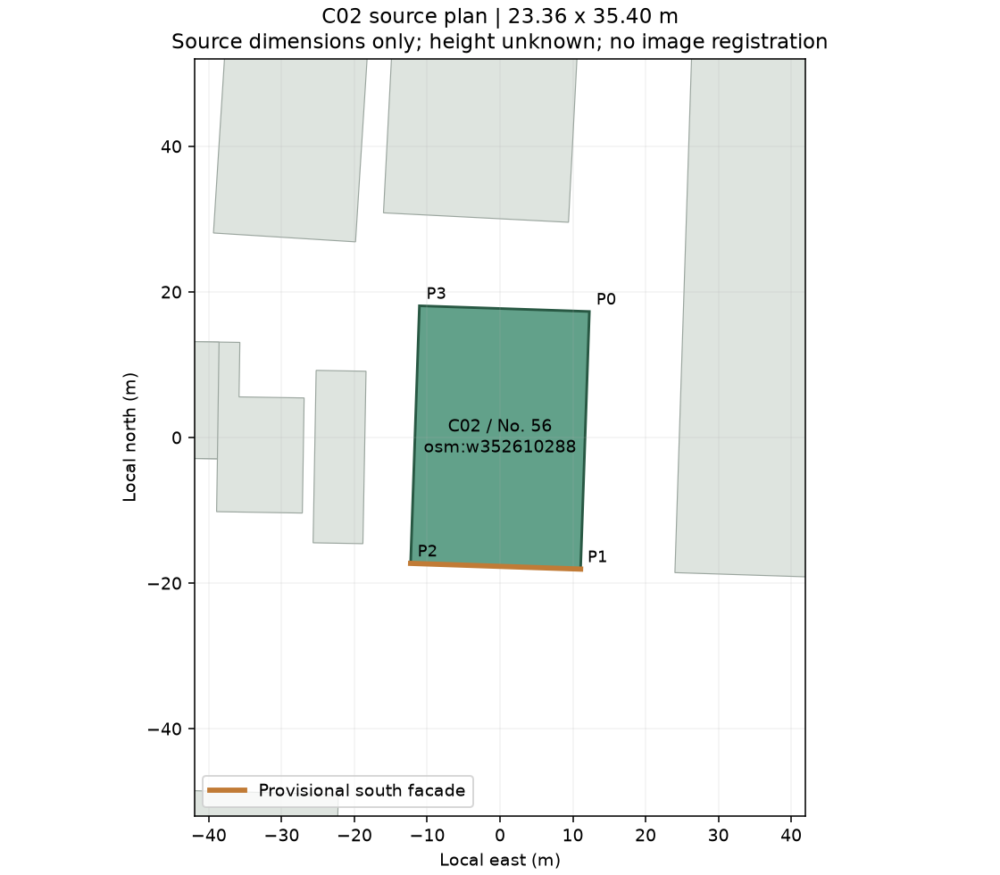

# P3：C02身份与源轮廓核对

日期：2026-09-26。本轮厘清沙面大街56号的名称/历史别名及源描述冲突，准备独立立面样件输入；没有新增运行时模型。

## 身份结论

| 对象 | 地址 | 对C02的处理 |
| --- | --- | --- |
| 正金银行旧址 | 沙面大街56号 | 作为规范名称，与`osm:w352610288`的源门牌对应 |
| 美国领事馆旧馆 | 沙面大街56号 | 保留为有资料支持的历史别名，不声称各阶段的具体起止时间 |
| 亚细亚火油公司旧址 | 沙面大街59号、沙面四街1、3号 | 排除为本对象身份；原OSM描述中的对应部分不用于建模 |
| 美国领事馆新馆 | 沙面三街2号 | 另一处实体，不按同名合并 |
| 另一处正金银行旧址 | 沙面北街73号 | 另一处地址，不按银行同名合并 |

主要依据为[荔湾区政府公开的总体规划附表七](https://www.lw.gov.cn/attachment/7/7813/7813682/10031492.pdf)：PDF第108页、印刷页109将56号正金银行和59号亚细亚火油分列；PDF第110页、印刷页111将美国领事馆旧址列在沙面三街2号。

56号与美国领事馆旧馆的别名关系由[公开代表建议](https://www.lw.gov.cn/attachment/7/7580/7580876/9573974.pdf)第6—7页，以及[2026年沙面调查公示简本](https://www.lw.gov.cn/attachment/8/8070/8070325/10992582.pdf)第44—45页相互支持。代表建议不是政府认定结论，公示简本也不是最终审批；这里仅用于历史称谓与地址对应，不证明当前用途或精确边界。

本轮下载两份PDF到不入库的研究目录，提取文本并核对表格原始渲染页。公开成果保留事实摘要、URL、页码和SHA-256，不打包原PDF或其页面图片。

## 数据处理

新增[独立身份核查层](../data/evidence/building-identity-reviews.json)，C02状态为`document-address-supported`。保存原描述、逐项采用/不采用决定、排除地址、证据引用和原快照哈希。

**没有改写原始OSM，也没有向OSM提交编辑。** 原描述`former US Consulate, Asian Oil Company (UK)`原样保留；其中前者作为历史别名有支持，后者与本地址的对应未获支持。候选生成器读取核查层更新显示名称和结论，但不改变源几何、未知高度或生产准入状态。

已同步[12个候选JSON](research/p3-building-screening/candidates.json)与[候选CSV](research/p3-building-screening/candidates.csv)。本轮只有C02身份字段推进，不能因此把12个候选都视为已核实。

## 照片与几何仍有边界

现有C02照片由古海岸遗址摄于2023-01-07，题名为正金银行旧址，许可[CC BY-SA 4.0](https://creativecommons.org/licenses/by-sa/4.0/)。[原始页面](https://commons.wikimedia.org/wiki/File:Guangzhou_Liwan_Shamian_ZhengJin_Yinhang_Jiuzhi_20230107.141132.jpg)与56号名称/可见立面形式相容，但门牌尚未完成独立辨读，无可靠相机坐标，也没有像素配准。因此照片对应保持`provisional`，不写成照片已精确落位。

源轮廓推导的南侧短边约23.359m、长边约35.404m、面积约827㎡；这些是OSM几何计算值，不是现场测量。南边作为临街正面候选，是当前建模推定。



绿色为C02，橙色为暂定南侧正面，灰色为周围源轮廓。来源© OpenStreetMap contributors，ODbL-1.0。准备数据见[plan.json](research/p3-c02-identity/plan.json)，高度仍为null。

下一样件的范围：2023照片中可见的三大拱、通柱与入口；高度、开间、廊深和檐口均需标估计。树木遮挡的两翼、侧后面和完整屋顶暂缓，不借别栋建筑的立面补齐。

## 验证与下一步

- 新增2项回归：56号身份与其他地址不混配；身份提升不自动升级高度、照片配准或生产可用状态。
- 58项项目测试通过，0失败、0跳过。
- 候选源哈希及照片哈希检查通过；4个基础城市文件和3个现有精细参数包保持原哈希。
- 本轮只更新研究数据与生成工具，无新运行时几何，因此没有新的浏览器模型验收。[验证记录](research/p3-c02-identity/validation.json)

复现：

```sh
.research/p0-2026-09-25/.venv/bin/python tools/screen-building-candidates.py
.research/p0-2026-09-25/.venv/bin/python tools/prepare-c02-plan.py
python3 tools/verify-building-screening.py
npm test
```

后续已完成[C02独立正面比例样件](P3-C02正金银行独立样件-2026-09-26.md)，继续复用P2。身份依据已足以支持这项局部研究，仍不足以进入主城高精度替换。
