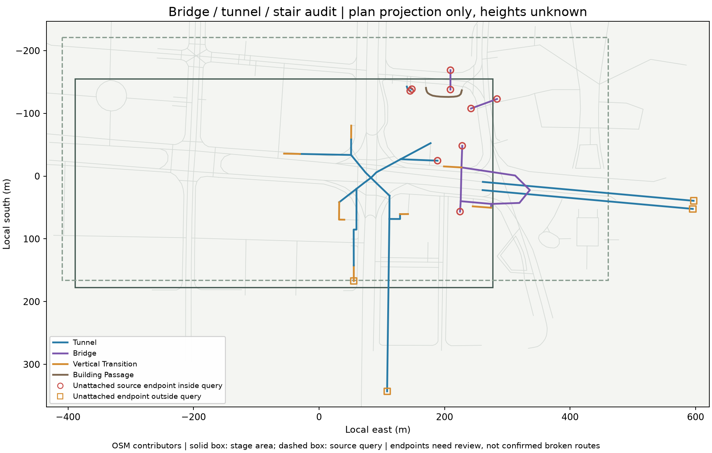

# P3：分层通道审计与下一步

日期：2026-09-26。当前成果仍是三栋建筑、双路口的本地样区，P3尚未完成全部扩展及整体验收。

## 这轮完成了什么

统一两条数据生成链路的分层判断，覆盖桥梁、隧道、穿楼通道、台阶/扶梯、非零或异常layer/level、室内路径与明确坡度。缺高程的特殊结构不参与平面铺装生成，并在参数包保存稳定源ID及延期类别，便于后续逐项接入。

当前样区未发现原有桥隧混入地面。本轮的主要成果是防错规则、可追溯的特殊结构清单和端点核对，不是新增29个立体模型。

| 样区源way类别 | 数量 |
| --- | ---: |
| 可进入当前地面模型的假定地面要素 | 154 |
| 隧道段 | 15 |
| 桥上段 | 5 |
| 台阶/扶梯等垂直连接 | 7 |
| 穿楼通道 | 2 |
| 合计 | 183 |

其中143个源way出现在已打包的地面道路、过街或人行路径集合中，全部能关联原始记录，未发现特殊分层要素混入。分类记录的数量不等于独立道路、桥梁或通道数量。



图是平面投影，不表达桥面或地下高程。实线框是本批样区，虚线框是源数据采集范围；红圆表示采集框内未接续的源端点，橙方表示采集框外端点，均不等于已证实的现实断路。

## 端点核查结论

29条特殊结构way中：

- 19条两端均与其他highway way共享源节点。
- 4条的未接续端点位于原始采集框外，应先补范围，不能作为区域内断路。
- 6条存在采集框内未接续端点，需判断是合法入口终点、快照缺项还是源数据漏连。

采集框内待核的源way：`559470933`、`559470935`、`559470965`、`1062033386`、`1374671611`、`1374671612`。

4条受范围限制的源way：`248407682`、`248407685`、`991905340`、`995559496`。其中台阶`991905340`的端点刚好位于采集框南侧外，不能只看样区范围就认定漏连。

共享节点只能证明源数据的连接关系，不能单独证明当前可以通行、符合路权或无障碍要求。没有基于二维交叉自动补连，也没有生成虚构高程。

[完整审计数据与端点引用](research/p3-road-layers/audit.json)

## 解释规则

`layer`描述交叠对象的相对层级，不等于米制高度；负值也不能单独证明位于地下。`level`描述楼层。穿楼通道通常可以处于地面层，因此单独分类，不一概称为地下通道。依据：[OSM layer](https://wiki.openstreetmap.org/wiki/Key:layer)、[level](https://wiki.openstreetmap.org/wiki/Key:level)、[building_passage](https://wiki.openstreetmap.org/wiki/Tag:tunnel%3Dbuilding_passage)。

`covered=yes`本身不会被误判成地下；`foot=no`也不会被误读为没有人行道或不在地面。所有延期要素的米制高度保持未知。

## 验证

- 46项项目测试通过，0失败、0跳过。
- 8项GIS测试通过：上一批标线4项，本批分层4项。
- 新回归覆盖正/负层级、楼层混合值、异常值、台阶、穿楼、坡度及端点来源。
- 与本轮开始时逐字段比较，路面、铺装、标线、线位和建筑参数一致；四个基础城市文件也与基线一致。仅增加审计元数据。
- 本轮没有渲染几何变化，复用上批真实场景证据；不把数据审计称为新增视觉效果验收。
- [本轮验证记录](research/p3-road-layers/validation.json)

复现：

```sh
.research/p0-2026-09-25/.venv/bin/python tools/build-p2-samples.py
.research/p0-2026-09-25/.venv/bin/python tools/build-detail-tiles.py
.research/p0-2026-09-25/.venv/bin/python tools/audit-road-layers.py
.research/p0-2026-09-25/.venv/bin/python tools/plot-road-layers.py
.research/p0-2026-09-25/.venv/bin/python tests/road_layers_test.py
.research/p0-2026-09-25/.venv/bin/python tests/road_markings_test.py
npm test
```

## 接下来按什么顺序推进

### 1. 先补关键事实，收敛待核清单（定向补核查已完成）

见 [本批结果](P3-端点补采与标线复核-2026-09-26.md)：10条端点中8条取得来源解释、2条仍待核；14条标线明确延期。以下保留原计划范围。

针对上面的6条框内端点读取关联源way与入口信息，对4条框外端点做小范围补取；同时核对上一批8条缺标线和6条冲突记录。只补样区所需数据，保留新旧快照、时间与来源，不直接全城刷新或自动编辑OSM。

交付：端点与标线逐项结论、数据增量及未能确认的原因。通过条件是每项有证据结论或明确延期，不能靠猜测把清单清零。

### 2. 再做一条完整立体通道样板（独立比例原型已完成，实体接入待核）

见 [春—夏广场连廊S1](P3-春夏广场连廊比例样板-2026-09-26.md)：44.16m源端点跨度、可剖开围护及照片对照已可浏览；桥面高/廊宽仍是假设，尚不满足完整通行链路或主城替换条件。

优先从源节点两端已连接的对象中选一条“地面—台阶—桥面”链路，或一条有明确入口的地下通道。先取得可用的高度、阶数、坡度或照片依据，做独立样件，核对接入关系和遮挡，再并入主场景。没有可靠高度时只推进拓扑/比例原型，不把`layer × 常数`当作实测高度。

交付：一条可以从起点走到终点检查的结构样板及资料对照。通过条件包括没有跨层假连接、悬空断口和错层相交。

### 3. 补建筑关键依据，再扩展数量（候选初筛已完成）

[本批记录](P3-建筑依据与候选初筛-2026-09-26.md)：12个源ID候选、63个补充轮廓初筛，2张新照片已视觉检查；均未达到生产接入条件。C01基督教沙面会堂优先进入独立样件准备。

优先解决B2照片面的方位、B1/B3高度基准及已有样件的关键缺面。然后审核63个Overture候选，整理10–20栋有身份与照片的建筑候选；逐栋核对后再接入。没有资料的对象保持低细节或pending，不为了数量复制立面。

交付：建筑字段级证据表、候选取舍记录与下一批可浏览模型。扩展以证据齐备度为门槛，不以增加面数为进度。

### 4. 做完整P3验收，再进入P4逐街区扩展

固定设备、分辨率和机位，检查日间/夜间/雨天、近景到俯瞰、快速切换、加载失败回退、资源释放及帧时。同步完成建筑与道路几何、源身份、分层连接及未知项检查。

交付：可重复的验收记录、性能基线与剩余限制。只有这一步完成，才适合把P3标为完成并估算下一街区的成本。

**S1定向核查已完成一批：修正坐标镜像，取得春端三楼的历史报道；米制标高及现状继续延期。下一次执行第3步，补核B2方位与B1/B3高度依据，再整理建筑候选。** 见[本批记录](P3-连廊朝向与历史接口核对-2026-09-26.md)。

**C01独立样件已完成**，见[本轮记录](P3-C01沙面会堂独立样件-2026-09-26.md)。C01本批已补北段四个侧窗，见[记录](P3-C01北段侧窗补充-2026-09-26.md)；完整长侧、门廊宽度与高度暂缓。C02身份核对已完成，见[记录](P3-C02身份与源轮廓核对-2026-09-26.md)。C02独立正面样件也已完成，见[记录](P3-C02正金银行独立样件-2026-09-26.md)。C02双柱及左翼已根据2021照片修正，见[记录](P3-C02双柱与左翼修正-2026-09-26.md)。统一预检已完成，见[结果](P3-样件尺度与落位预检-2026-09-26.md)：修正P2地面、模型高度显示和C02台阶，发现C01旧部件需要专门处理。C01/C02隔离试落位及加载回退验证已通过，见[记录](P3-C01C02隔离试落位与回退验证-2026-09-26.md)。当前下一步：试验入口的昼夜、雨天及快速切换验收；默认主城暂不扩容，照片精确配准和米制高度继续待核。B1/B3高度与B2照片方位保留待核，主城暂不扩容。
