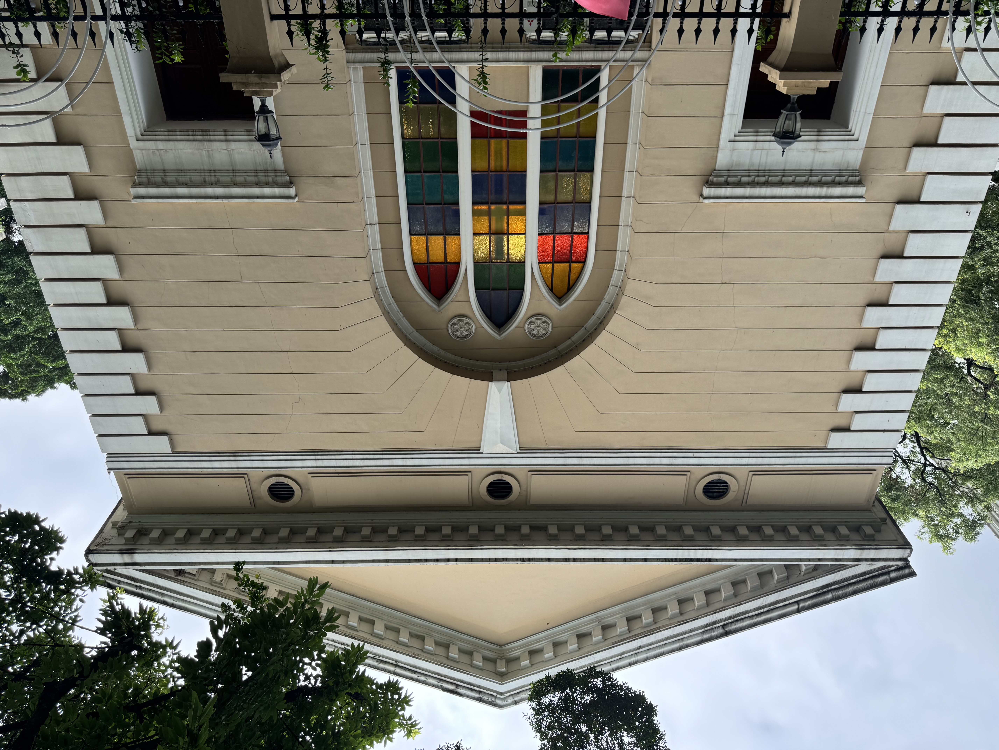
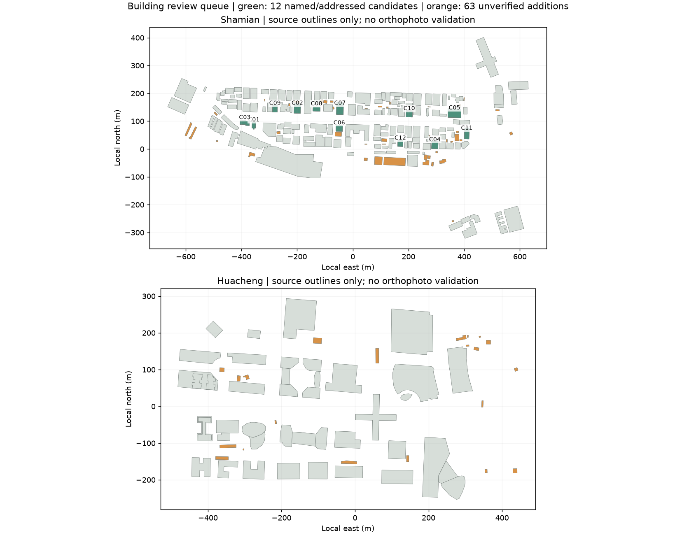

# P3：建筑依据复核与下一批候选初筛

日期：2026-09-26。本轮交付字段复核、12个建筑候选和63个补充轮廓的初筛记录；没有新增生产模型，也未修改现有建筑高度。

## 现有样件

| 样件 | 本轮结论 | 模型处理 |
| --- | --- | --- |
| B1 台湾银行旧址 | 搜到15m檐高、16.8m总高的转述，但未取得一手尺寸页 | 保留14.2m比例估计；转述列为待追溯线索 |
| B2 沙面一街3号 | 东主立面/北侧阳台文字线索与当前解释相容，尚无新的照片配准 | 保留文献檐高20.6m；F0北侧短边仍暂定，不升级朝向状态 |
| B3 露德圣母堂 | 2026公示简本第61页可核大堂1层、钟楼3层、朝南及大堂约238㎡，没有塔高 | 保留25.4m比例估计；不按层数换算米，也不采用无出处的28m |

B1已阅读[广州学习平台的建筑介绍转载](https://wap.ycwb.com/2021-12/18/content_40460312.htm)，它能支持地址、身份和柱式描述，不能支持高度。B2继续以[2023修缮验收资料](https://wglj.gz.gov.cn/attachment/7/7536/7536808/9433868.pdf)为檐高依据。B3本轮对照了[2026公示简本](https://www.lw.gov.cn/attachment/8/8070/8070325/10992582.pdf)的原始渲染页；公示草案、楼层数和占地面积都不等于现场米制测量。

逐字段结论见[field-review.json](research/p3-building-screening/field-review.json)。本轮检索围绕三栋对象的高度、檐口、钟楼和立面方向；同名异地银行/教堂、百科和游记的无出处数字没有转成建模参数。

## 12个下一批建筑候选

后续C02已完成[身份与源轮廓核对](P3-C02身份与源轮廓核对-2026-09-26.md)：56号正金银行及美国领事馆旧馆的对应有公开资料支持，亚细亚火油描述不用于该地址。下面的表保留初筛时状态，更新后的逐字段结论见CSV/JSON。

这是一份**调研与建模候选队列**，不是12栋已具备完整资料的建筑。当前2栋看过局部立面照片，1栋只有待检查的照片线索，另外9栋待补照片。全部缺独立高度，生产接入通过数为0。名单沿用现有沙面源身份，排除B1/B2/B3；现代用途、历史名称和具体地址不混作同一个已核事实。

| 编号 | 候选 | 源ID | 照片 | 下一项核查 |
| --- | --- | --- | --- | --- |
| C01 | 基督教沙面会堂 | `osm:w509641361` | 已看局部立面 | 地址与Commons类别对应；南侧照片可核 |
| C02 | 沙面大街56号（旧正金银行候选） | `osm:w352610288` | 已看局部立面 | 地址可对照；OSM旧用途描述与照片命名有分歧，须核铭牌 |
| C03 | 沙面大街69号（牧师住宅候选） | `osm:w1191446839` | 仅照片线索，下载限流 | 源地址与照片题名初配，需核门牌和轮廓 |
| C04 | 广东外事博物馆 | `osm:w352610325` | 待补 | OSM名称明确，待补对应年代自由许可照片 |
| C05 | 海关宿舍（沙面大街6号） | `osm:w352610283` | 待补 | 需先拆清红楼主副楼及2/4/6号的身份范围 |
| C06 | 渣打银行旧址（沙面大街49号） | `osm:w352610265` | 待补 | 源地址明确；不得与北街61号同名旧址混配 |
| C07 | 万宝楼（旧万国宝通银行） | `osm:w352610312` | 待补 | 名称与旧名仅来自OSM，需核照片 |
| C08 | 沙面大街50/52号（现星巴克标签） | `osm:w352610315` | 待补 | 经营标签不代表历史建筑身份或当前营业状态 |
| C09 | 洛士利洋行旧址 | `osm:w352610278` | 待补 | OSM名称地址明确，待补照片和尺寸 |
| C10 | 英国医院/招商局候选 | `osm:w352610320` | 待补 | OSM复合名称，需拆清时代与使用范围 |
| C11 | 旧摩罗叉公寓 | `osm:w352610272` | 待补 | OSM名称明确，待补门牌和照片 |
| C12 | 旧泰国人俱乐部 | `osm:w352610308` | 待补 | OSM名称明确，待补门牌和照片 |

[可筛选CSV](research/p3-building-screening/candidates.csv) · [含轮廓与证据的JSON](research/p3-building-screening/candidates.json)

## 优先做C01：基督教沙面会堂

后续已完成[C01独立样件](P3-C01沙面会堂独立样件-2026-09-26.md)，并纠正本批照片为北侧端墙；不能将该照片视为南侧钟塔主入口。以下保留初筛资料。

OSM为`w509641361`，源轮廓约315.86㎡（计算值，不是实测面积）。2026-05-18照片可辨三角山花、三圆孔、中央三联尖拱彩窗及两侧门；树冠和围栏仍遮挡部分结构，单张照片没有给出侧后面或高度。



C01照片：JULIANISME，2026-05-18 13:49:14，[原始页面](https://commons.wikimedia.org/wiki/File:Christ_Church_Shamian_20260518.jpg)，[CC BY-SA 4.0](https://creativecommons.org/licenses/by-sa/4.0)；原图未修改。

原图作者、许可和原始页面见[照片来源记录](research/p3-building-screening/photos.json)，两张已下载照片均为CC BY-SA 4.0，保留原图与哈希。C02照片显示三大拱、通柱和入口，但题名与OSM旧用途描述存在分歧，先核门牌与铭牌。C03下载返回HTTP 429，未反复重试，不计作已完成视觉检查。

C01独立样件已完成南北面区分与源轮廓配准；长侧墙、门廊宽度对应及高度仍待核，现阶段不直接进入主城替换。

## 63个Overture补充轮廓

- 沙面42个、花城21个；按本地AEQD投影计算，32个面积小于100㎡。
- 本批对象没有高度；身份与照片均未匹配。小面积只是优先人工核查的提示，不等于可以认定为附属房或噪声并删除。
- 每个对象保留源ID、源数据集、面积、最近OSM对象及距离、与OSM面域的重叠比例、边界/有效性提示。
- 最近对象只用于定位上下文，不能作为父建筑归属或合并依据。初筛只检查源几何和字段，没有正射影像确认。
- 全部标记`hold-for-identity-and-image-review`；没有自动替换、合并或删除。它们与上面12个既有OSM建筑候选是两组不同对象。



绿色为12个具名/有地址的OSM候选，橙色为63个未核补充轮廓，灰色为源OSM轮廓；图不表示测绘精度或当前现实状态。全量记录见[GeoJSON](research/p3-building-screening/outline-screening.geojson)。地图含© OpenStreetMap contributors源轮廓；原数据许可/来源继续参照P0 source-manifest及GeoJSON中的sources。

## 验证与下一步

源哈希、12个唯一建筑ID、63个唯一补充轮廓、照片许可字段和哈希、有限坐标及生产准入状态检查通过。4个基础城市文件和3个精细参数包保持原哈希。运行时没有变化，不重复执行上批52项测试，不宣称有新模型视觉验收。

复现：

```sh
.research/p0-2026-09-25/.venv/bin/python tools/screen-building-candidates.py
.research/p0-2026-09-25/.venv/bin/python tools/plot-building-screening.py
python3 tools/verify-building-screening.py
```

[验证记录](research/p3-building-screening/validation.json)。下一步以C01独立样件为交付目标，同时处理C02身份分歧；B1/B3高度和B2照片方位只在取得新的可绑定证据后更新，不反复用同一批转述放大确定性。
