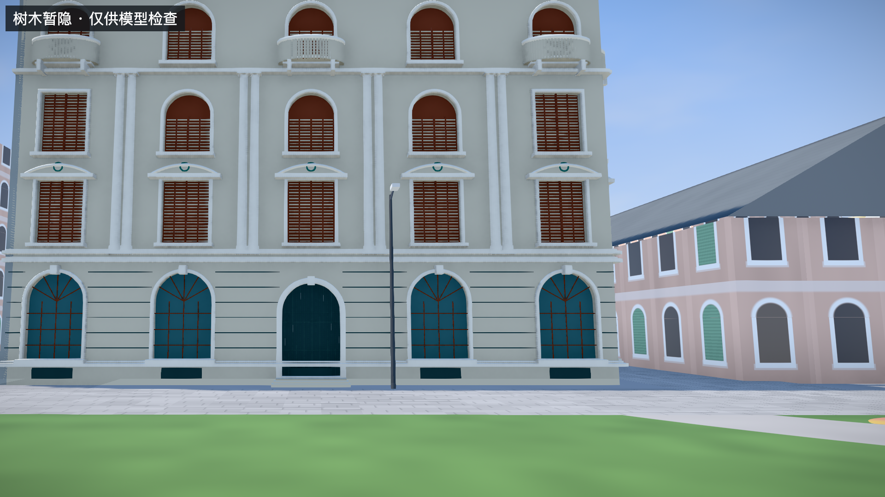
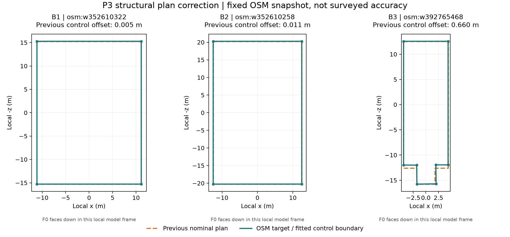

# P3：现有建筑轮廓、立面与遮挡修正

日期：2026-09-25。用户选择先修现有建筑的轮廓、朝向和遮挡，本批继续处理 B1/B2/B3，不扩展建筑数量。

后续补充：[文献檐高与朝向核对](P3-文献檐高与朝向核对-2026-09-25.md) 已更新B2高度依据与照片面称谓，本文保留上一批修正记录。

## 结果与入口

- [沙面一街3号](http://localhost:5174/#scene=detail-indochine)：拱形入口、三层中央拱窗、弧形窗楣与门窗栏格修正。
- [露德圣母堂](http://localhost:5174/#scene=detail-lourdes)：钟塔凸出部分与中殿按源轮廓配准。
- [三栋同场](http://localhost:5174/#scene=detail-shamian)：保留周边模型与植被。

在这些精细建筑预设中可点击“暂隐树木”。画面会显示“仅供模型检查”，可以旋转检查，再点击“恢复树木”；切换到其他预设会自动恢复。默认保留树木，未更改树木数据或数量。导出检查模式截图时，图片本身也带提示，避免把分析视图误当成现实环境。树木高低细节及远景表示一起切换，路灯仍保留。



## 轮廓修正的依据和限度

使用 P0 固定 OSM 快照中的原始顶点，经现有城市坐标变换落位。此前三个模型主要以最小外接矩形落位，教堂钟塔宽深和凸出长度仍为固定参数。

| 样件 | 修正前名义结构平面与源轮廓 IoU | 对应控制点最大偏移 |
| --- | ---: | ---: |
| B1 台湾银行旧址 | 0.999823 | 0.0054m |
| B2 沙面一街3号 | 0.999721 | 0.0113m |
| B3 露德圣母堂 | 0.983225 | 0.6603m |

主要问题集中在 B3 钟塔与中殿衔接处。现在使用对应控制点建立分片仿射映射，并实际作用于网格、法线和构件位置；高度保持不变。四边形保留源轮廓的轻微斜交，教堂保留八点凹凸关系。窗台、檐口等突出构件沿局部变换延伸，不强行压平到建筑边界。

校验比较的是**模型名义结构控制边界与输入 OSM 轮廓**，不包含窗台/檐口等外挑构件，也不是全部网格投影覆盖率。配准后控制点在数值容差内吻合输入轮廓；这并不表示真实外墙误差为零。源数据本身的位置误差、实际墙厚、构件尺寸、建筑高度和高程仍未经过独立测量验证。



对应输入：[源轮廓](research/p0-2026-09-25/shamian-osm-buildings.geojson)、[配准前统计](../data/detail/building-fit-report.json)、[配准后校验](research/p3-building-corrections/validation.json)。图中使用各模型局部坐标，向下是模型主面方向，并非统一地理南向。

## 立面与朝向核对

重新检查已有 B2-a（2023）和 B2-b（2012）照片，修正了此前误画的矩形入口及三角形门头，补回拱门栏格；三层中部改为拱形窗，二层窗楣改为弧形。首层窗格采用木色表达。尺寸、材质颜色和细小纹饰依然是比例估计，未据此提高整体真实性等级。

照片来源、作者与许可继续见 [P0 逐张记录](research/p0-2026-09-25/photo-review.md)。本轮没有新增下载照片，没有把不同年份颜色混为同期实况，也未把照片烘焙成纹理。

朝向结论没有升级：B1/B3 继续依据源轮廓与临街关系朝南落位；B2 北侧短边的主面位置仍为照片解释后的暂定方案。当前照片与轮廓不足以完成独立朝向验证，所以没有将其改成“已核实”，也没有再次套用 P0 曾推定的东侧标签。

## 遮挡核对

检查已解码的树木中心位置，三栋源轮廓内部均未发现树根中心；本批没有删除树木。这个检查只能排除根部点位侵入，不能证明树冠与墙体完全无相交，也不能证明程序生成的树木是逐棵真实位置。

实际主场景中树冠会遮挡部分门窗；临时检查模式用于区分环境遮挡与模型缺陷。它不是修剪树木或现场环境变化的表达。未核实的背面、屋顶及侧面仍保持低细节。

## 验证

- 全套33项测试通过，0失败、0跳过；最终模型与保护校验调整后，相关8项再次通过。
- 新增回归覆盖凹轮廓控制点、实际嵌套网格变换、法线与高度保留、旧控制点拒绝、拱肩射线遮挡。
- 配准失败或旧控制点与模型不匹配时拒绝资源，沿用 P3 基础模型回退；失败生成的模型资源会释放。
- 真实浏览器检查 B2 与 B3 主场景；暂隐/恢复、拖动保持检查状态、切换预设恢复均已观察。
- 实际导出 PNG，检查模式标记存在于图片中，已保存为本报告的 B2 截图。
- 390×844 窄屏按钮可操作，页面宽度与内容宽度均为390；这只是响应式检查，不代表真实手机性能验收。
- 三栋主场景块状态为 ready/active；检查日志无 error/warn。
- 四个基础城市数据文件与 P2 阶段基线哈希一致；两个道路参数包未变化。

复现命令（项目根目录）：

```sh
.research/p0-2026-09-25/.venv/bin/python tools/build-detail-tiles.py
.research/p0-2026-09-25/.venv/bin/python tools/plot-building-fit.py
node tools/verify-building-fit.mjs
npm test
node serve.mjs 5174
```

本轮未扩大到10–20栋、未补造未知背面、未完成独立地理精度验收或桥隧扩展。P2独立查看器沿用共享立面几何，地理平面配准在主场景参数包中应用。
