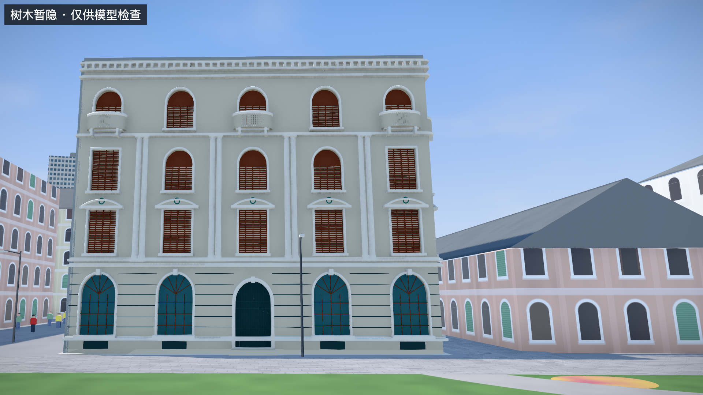

# P3：文献檐高与朝向核对

日期：2026-09-25。继续用户选定的“先修现有建筑准确性”范围，本次没有扩大建筑数量。

后续：[柱廊结构与转角证据](P3-柱廊结构与转角证据-2026-09-25.md) 已利用新增历史转角照片补充东侧柱廊，精确朝向仍未独立核实。

## 本批变化

沙面一街3号（B2）现在使用文献檐高20.6m作为垂直约束，主场景与独立查看器共用同一来源。界面明确区分檐高、总高与其他估计尺寸，并提供原始PDF及页码。B1、B3的高度保持原有估计。

[查看主场景](http://localhost:5174/#scene=detail-indochine) · [查看样件与来源](http://localhost:5174/prototypes/p2/#B2)

## 新取得的依据

广州市文化广电旅游局公开的[竣工验收材料](https://wglj.gz.gov.cn/attachment/7/7536/7536808/9433868.pdf)，封面为广东省古迹保护协会2023年10月7日的粤古协函〔2023〕650号。第13页勘察设计单位意见与第21页项目概况都记载了20.6m屋顶檐高，并说明主入口所在街道为沙面一街。已核对页图，不只采用检索摘要。

这是竣工验收材料，**不是此前检索阶段所误称的文物影响评估报告**，附件没有提供完整立面或剖面尺寸图。本次只提取事实字段及来源链接，没有将PDF及其中照片随公开模型包再发布。

另查阅了[2026年9月4日公示的全岛调查简本](https://www.lw.gov.cn/zzzs/tzgg/content/post_10992582.html)。第15、16、46页能提供已有样件的立面、外廊等参考，但没有找到本批可直接采用的B1/B3高度标注。该材料仍是公示简本，不将其当作最终批准文本或独立量测真值。

来源URL、文件SHA-256、日期、页码和使用边界保存在 [building-controls.json](../data/evidence/building-controls.json)。原PDF与OCR临时资料仅留在已忽略的 `.research/p3-evidence/` 中。

## 怎么应用20.6m

模型使用上部檐口线脚的控制线（原模型局部高度18.02）对应文献檐高，沿竖直方向调整网格与相关观察点，平面轮廓不变。保留原有网格层级并正确变换法线；门窗的射线测试继续通过。

**檐口控制线的对应解释和地面零点仍是假设。** 原文没有提供用于本项目配准的高程基准或详细剖面图，因此它是 `reported` 文献值，不能标成 `measured`。各楼层及开口按原有比例调整，未因此获得独立尺寸依据。屋面、女儿墙和装饰物的最高点也不能以20.6m代替。

运行时如果缺少来源、页码、合法数值或对应模型控制点，会拒绝该标定并沿用精细块失败回退流程。未配置文献约束的B1/B3不会受影响。

## 朝向结论的纠偏

原文直接给出的是主入口所在街道。现有OSM沙面一街 `w132767198` 位于B2东侧：按当前局部坐标计算，建筑中心到该线最近点约向东23.59m、向南1.15m。因此“主入口在东侧”是**验收材料结合源路位的推断**，不是原文给出的精确方位角。

现有五开间照片面F0与建筑主入口面不能混称。F0在主场景仍暂置北侧短边，卡片、查看器和样件元数据已改用“照片面暂置北侧”的说法；此前P0的东侧标签保留在历史资料中，生成的当前样件另存旧标签并注明待核。本轮没有把五开间照片面强行旋转或拉伸成东侧长立面。

尚缺能明确绑定拍摄方位的照片或带北向的立面图。这仍是下次准确性工作优先解决的缺口。

## 验证与范围

- 全套36项测试通过；最后来源元数据更新后，3项垂直约束测试再次通过。
- 覆盖实际嵌套网格高度变化、平面保持、檐高不等于总高、无来源拒绝，以及B1/B3不受影响。
- 实际浏览器查看主场景与独立查看器，来源链接、页码、状态切换均可见；主场景检查日志无error/warn。
- 调整了B2观察机位，暂隐树木后可完整观察檐口至入口；默认树木保留，截图带检查模式标记。
- 四个基础城市数据文件与既有基线哈希一致，道路几何与参数包未修改。
- [结构化验证记录](research/p3-building-controls/validation.json)

仍未解决：照片面确切方位、独立地面高程、逐层高度、完整背面与总高。当前成果不代表测绘级1:1验收。
