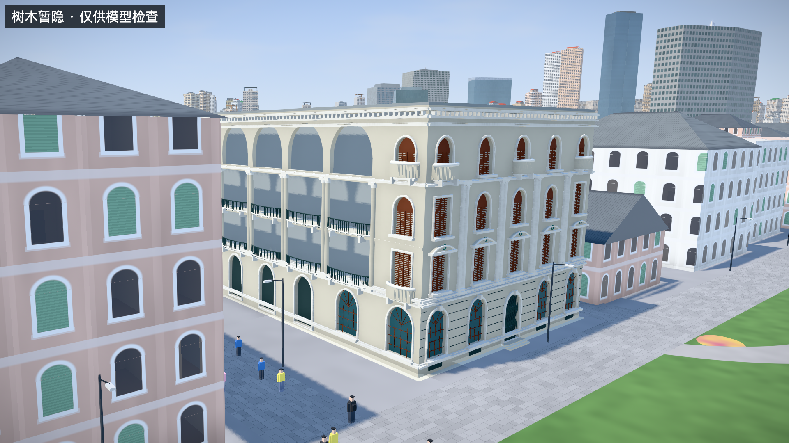
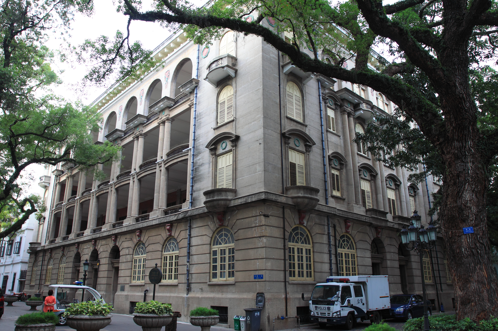

# P3：B2柱廊结构与转角证据

日期：2026-09-25。继续现有样区的准确性修正，本批补充沙面一街3号长边柱廊，不扩展建筑数量。

## 成果

- 二、三层中部开放柱廊，通高圆柱与真实后退空间。
- 四层连续拱廊，保留开放拱洞。
- 首层三个拱形入口、端部窗和栏杆；构件尺寸仍为估计。
- 移除了与新柱廊重叠的旧简化侧墙，保留内侧未知墙面。
- 主场景新增“东方汇理银行柱廊”机位；独立查看器默认转角面向该侧，并提供新增原图对照。

[主城柱廊入口](http://localhost:5174/#scene=detail-indochine-east) · [模型与原图](http://localhost:5174/prototypes/p2/#B2)

## 证据

新增核查照片：[Guangzhou Shamian 2012.11.15 10-05-31.jpg](https://commons.wikimedia.org/wiki/File:Guangzhou_Shamian_2012.11.15_10-05-31.jpg)。作者 Zhangzhugang，拍摄时间2012-11-15 10:05:31，采用其提供的 [CC BY-SA 3.0](https://creativecommons.org/licenses/by-sa/3.0/) 许可。保存的是未改动原图，来源与校验值见 [photos.json](research/p3-facade-review/photos.json)。

照片能支持长边中央五个开放开间、圆柱、二三层廊道、四层拱廊，以及与五开间短边相接的关系。它不能直接提供廊深和准确构件尺寸，也不能证明今天仍保持相同颜色或门窗状态。

长边落在东侧的依据仍是此前验收材料的主入口街道、现有OSM沙面一街路位和本次转角关系的组合判断。照片本身没有可靠拍摄方位。其EXIF坐标距源建筑约1.56km，已标记为异常，不用于配准。北侧照片面F0仍保留暂定标记，未把这次推断写成实测或精确方位角。

## 几何与精度处理

当前廊深为2.6m估计值；檐口继续使用20.6m文献约束。沿街外墙的平面控制边界保持不变，柱廊向轮廓内部后退，内部房间、门窗和装修保持未知表达。

二三层圆柱之间不留额外实体墙墩，楼板与栏杆分开建模；四层开口后不铺玻璃。来源支持的是结构形式，颜色、深度、栏杆细纹及尺度属于解释和估计。历史照片中的旧颜色没有作为2026现状直接复制。

本次B2几何约113,155个三角形；仍沿用材质合批、按位置加载与失败回退。新照片仅用于研究与独立查看器参考，主城参数包不包含该JPEG。

## 验证

- 全套38项测试通过，0失败、0跳过；最终几何调整后，相关13项通过；补充来源与朝向断言后，柱廊2项再次通过。
- 射线覆盖二层、三层、四层开放区域，确认首个遮挡位于后退墙而非旧外墙或玻璃；首层仍有实体，不因清理侧墙一起消失。
- 生产落位后的柱廊法向朝东；这只验证代码符合当前推断，不证明地理朝向已独立核实。
- 三栋平面控制点配准、B2文献檐高、原有窗洞、资源生命周期与构建基线均继续通过。
- 实际浏览器检查独立样件及主城转角；无error/warn日志。验收截图带“树木暂隐”标记，完成检查后已恢复树木。
- 四个基础城市数据文件与既有基线一致，两个道路参数包未改变。

[结构化记录](research/p3-facade-review/validation.json)

仍缺：近年同视角照片、独立廊深与构件尺寸、精确拍摄方位、完整内部/背面。该历史结构参考不等于2026年完整复原。
