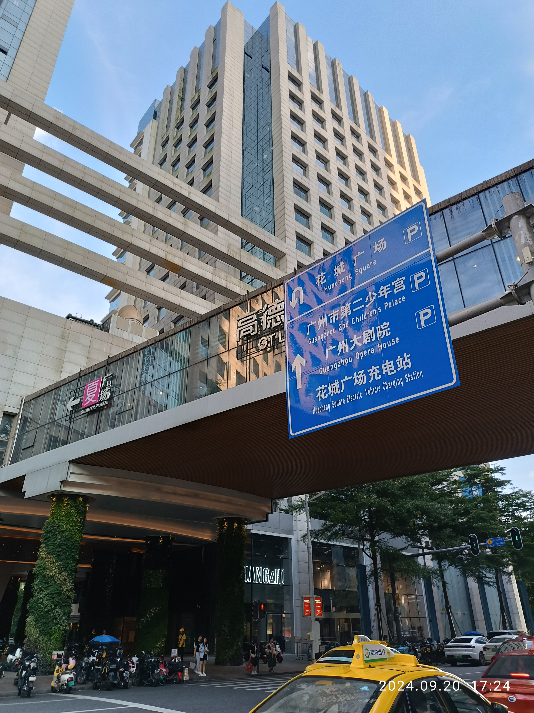

# P3：端点补采与标线复核

日期：2026-09-26。本轮执行上次计划的第1步，集中核查10条端点待核way及14条标线待核way。使用免费公开OSM接口、Commons照片和政府公开资料；没有编辑OSM、刷新全城基础包或发布模型。

## 结果

10条端点待核way中，8条找到了源数据解释：3条补回外侧关联道路，3条识别为建筑边界接口，2条带有入口/停车场终点标签；另2条仍缺证。

14条标线way及其节点标签未发生变化：8条仍缺明确标线字段，6条仍有冲突。保留原有暂缓绘制策略，没有因为重新下载一次、或节点重复相同标签就提高可信等级。

这是来源核查结论，**不等于实地通行验收**。建筑接口的室内通路、高程，入口开放条件和实际标线仍需分别核实。

## 端点逐项结论

| 原待核way | 结论 | 新核对的依据 |
| --- | --- | --- |
| `248407682` | 找回源道路连接 | 节点`2551976629`同时属于花城大道`248407684` |
| `248407685` | 找回源道路连接 | 节点`2551976815`同时属于花城大道`519199421` |
| `991905340` | 找回源步道连接 | 地铁B1入口节点`5021418973`同时属于步道`1373459683` |
| `559470933` | 建筑边界接口 | 两端分别与高德置地春广场、夏广场建筑轮廓共享节点 |
| `559470935` | 建筑边界接口 | 两端分别与春广场、广东全球通大厦轮廓共享节点 |
| `559470965` | 建筑边界接口 | 与广州友谊商店（国金店）、春广场/B座轮廓共享节点 |
| `995559496` | 有标签的终点 | 节点`9193190521`标注服务入口、地铁C及电梯相关说明；未证明现时开放与室内连接 |
| `1374671611` | 有标签的终点 | 节点`12728511072`标注地下停车场；不将停车场内部道路补造出来 |
| `1062033386` | 仍待核 | 节点`9756881916`没有取得其他关联way或入口标签 |
| `1374671612` | 仍待核 | 节点`12728511075`没有取得其他关联way或入口标签 |

接口返回的其他way只有实际引用同一个node ID才计入依据。没有使用位置接近、二维交叉或建筑名称相似来补连。完整的关联对象、节点标签和响应文件见 [review.json](research/p3-source-review-2026-09-26/review.json)。

原审计只检查highway之间的连接，未把建筑边界和带标签的目的地单独解释。因此这次部分进展是更准确地解释原有数据，并非现实中新增了道路。

## 数据增量

共完成16次只读API请求，响应约46,972 bytes；采集时间为北京时间2026-09-26凌晨，逐请求URL、时间、服务器日期和SHA-256见 [sources.json](research/p3-source-review-2026-09-26/sources.json)。

在本次取回的对象中，172个既有对象的版本、节点序列、标签和节点坐标与原快照一致。可补入的内容仅为：

- 3条way：`248407684`、`519199421`、`1373459683`。
- 7个此前不在区域快照中的节点。

[增量包](../data/evidence/huacheng-review-delta.json)绑定原快照SHA-256。`merge_network`仅在基线吻合时合并新ID，拒绝覆盖旧对象、重复ID或缺失节点引用。增量用于后续结构建模准备，本轮未替换运行时城市几何。

资料许可：© OpenStreetMap contributors，ODbL-1.0。原始响应按版本化研究目录保存，可离线复核；重跑核查使用已校验的缓存。需要再次取得新状态时应建立新日期快照，不能覆写本次证据。

## 标线与照片复核

当前way和关联节点未提供新的独立答案。6组冲突在way和node上重复出现，重复记录不能当成两份独立确认。14项逐条状态及标签均保留在本次review文件中。

本轮检索没有取得足以逐way解除待核的新资料。例如，[花城大道员村南街—科韵路公示](https://fgw.gz.gov.cn/gkmlpt/content/10/10834/post_10834779.html)属于其他路段，未采用其中的路幅数据。[华夏路照片目录](https://commons.wikimedia.org/wiki/Category:Huaxia_Road,_Guangzhou)中新增检查了两张CC0照片：R5主要拍建筑仰视，R6能看到连廊及局部条纹，但条纹未能绑定到14条目标way之一。

这不表示免费资料不存在，也不表示现实没有标线。本轮结论只是“证据仍不足”，检索边界与排除原因见 [public-search.json](research/p3-source-review-2026-09-26/public-search.json)。

## 下一步连廊样板的候选



R6可见“夏广场”名称及玻璃连廊。结合本次建筑边界接口资料，初步选定春—夏广场连廊 `osm:w559470933` 作为下一步独立比例样板候选。**这是初步照片匹配，尚未完成像素与源几何配准，不能从照片或layer直接取得实测高度。** 作者Ghaud Lnegauk，2024-09-20，CC0；原始页面、许可链接和文件哈希见 [照片记录](research/p3-source-review-2026-09-26/photos.json)。

下一步先核对两端建筑接口与相对断面，再做带估计标记的可浏览原型；高度、廊宽及现状没有依据时不进入正式高精度替换。两条仍待核端点和14条标线保留在待核清单，不阻塞独立样板研究。

## 验证

- 48项项目测试通过，0失败、0跳过。
- 4项新增补采回归通过：真实节点引用、建筑接口/终点区分、资料不全或端点变化、仅增量合并。
- 16份响应与2张新增照片均有来源及校验值；新旧对象没有混合冲突版本。
- 原基础城市、现有三个精细参数包保持原哈希，本轮没有新的渲染几何或视觉效果验收。
- [结构化验证](research/p3-source-review-2026-09-26/validation.json)

复现：

```sh
python3 tools/fetch-road-review.py
.research/p0-2026-09-25/.venv/bin/python tools/review-road-sources.py
python3 tests/road_source_review_test.py
npm test
```

第1步的“逐项结论或明确延期”已完成。当前仍不是完整P3验收，也没有增加新的桥隧实体。
