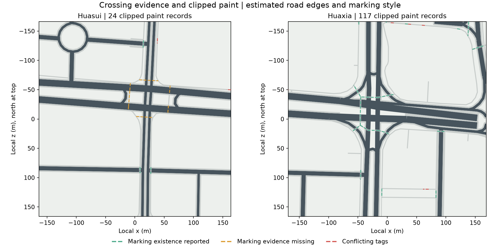
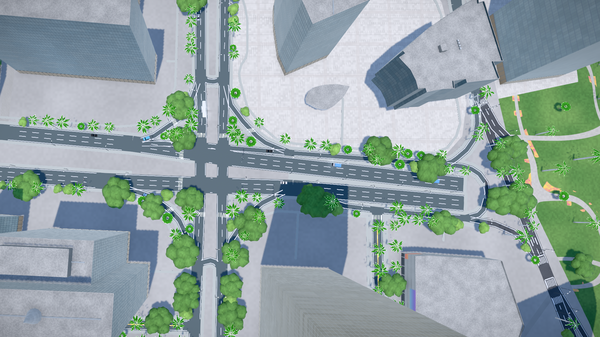
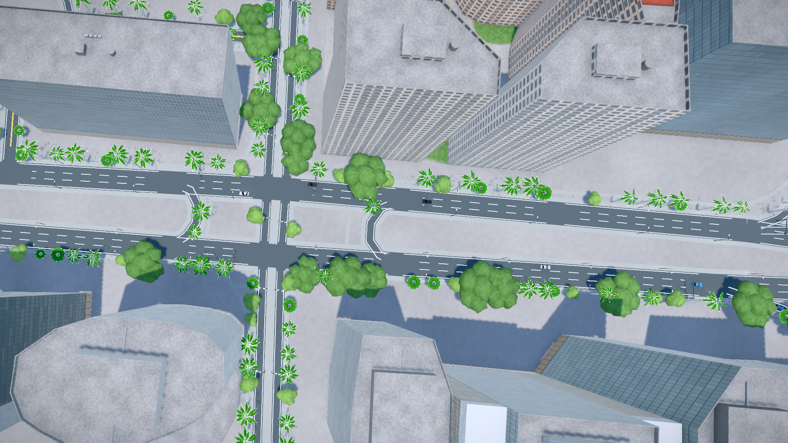

# P3：过街标线裁剪与证据校验

日期：2026-09-25。继续P3双路口范围，修正软件生成的标线越界与间距问题，区分过街路径、信号控制和标线证据。

[华夏路口](http://localhost:5174/#scene=detail-huaxia) · [华穗路口](http://localhost:5174/#scene=detail-huasui) · [独立查看器](http://localhost:5174/prototypes/p2/#J1)

## 本批结果

- 标线整体多边形裁剪到输入路面、路面孔洞、过街路径范围和瓦片边界。
- 间距按整条源way累计距离生成，避免每遇节点或瓦片裁切点就重新起排。
- 保留所有33条源过街way；其中19条有标线存在标签，8条缺证、6条冲突暂缓绘制。
- 为生成的条纹保存源ID、沿程位置、条纹索引、尺寸和样式状态。
- 独立查看器明确提示缺证状态，并保留节点线位与限制关系。

33条way是源要素记录数，不等于33处独立人行横道。同一way跨两个块时可能出现两次，但统计按源ID去重。



图中绿色虚线表示有标线存在标签的源路径，橙色表示缺证，红色表示标签冲突；这些彩线用于资料核对，不是现实路面涂装。

## 为什么减少了一部分斑马线

过街路径存在、或由信号灯控制，都不能单独证明路上有某种标线。`crossing:markings=yes`只说明标线存在，未指定样式；本批对这类已知存在的标线仍用估计斑马样式表达，并明确登记样式未核实。参见 [OSM标线字段](https://wiki.openstreetmap.org/wiki/Key:crossing:markings) 和 [信号字段](https://wiki.openstreetmap.org/wiki/Key:crossing:signals)。

当前6条源way同时包含 `crossing=unmarked` 和 `crossing:markings=yes`。本项目选择保守处理：保留原始标签、路线和冲突清单，待核实后再绘制，不自动覆盖其中任一值。完整ID及标签见 [校验结果](research/p3-road-markings/after.json)。

华穗独立查看器范围内的8条过街way均缺少明确标线字段，因此当前不画斑马线。**这不表示现实中没有标线，也不是道路被删除。** 可开启“节点线位”查看路径。华穗更大生产瓦片仍有其他具备存在标签的标线。

## 几何检查

旧算法只判断每根条纹的中心点是否落在路上，矩形角点可能伸出道路或进入岛洞；而且每段线重新起排，容易在节点附近出现间距变化。

| 瓦片 | 旧条纹记录 | 旧越界条纹 | 旧越界面积 | 新裁剪记录 |
| --- | ---: | ---: | ---: | ---: |
| 华穗 | 88 | 4 | 约0.508m² | 24 |
| 华夏 | 105 | 14 | 约3.350m² | 117 |

新旧数量不能作为还原质量分数：本批同时修改了证据筛选、起排位置和边界处理，部分仅边缘触路的条纹会保留裁剪后的有效部分。新多边形相对输入路面的越界面积低于数值容差，瓦片边界外面积为0。**这些是输入几何的一致性检查，不是对现实道路测量误差的证明。**

[旧算法复现结果](research/p3-road-markings/before.json) 与 [新算法结果](research/p3-road-markings/after.json) 均可重新生成。

接缝回归使用跨边界折线和带岛洞的合成场景：分别裁两块后合并，与一次裁整块的结果比较。当前有标线输出的真实源way没有同时跨过两个瓦片内部，因此不把该合成测试冒充现地接缝验证。

## 实际画面





两块主场景加载状态为ready/active，检查日志无error/warn。独立查看器已验证缺证提示和路径线位仍可见。

## 验证与复现

- `npm test`：44项通过，0失败、0跳过。
- GIS回归：4项通过，覆盖标签策略、增加节点不重置间距、跨块与岛洞、退化路径。
- 打包数据检查：多边形顶点与三角形中心不越路面；缺证、冲突不产生条纹；旧参数无标线时保留路面，不认识的新标线版本拒绝误读。
- 四个基础城市文件与P2基线一致，沙面建筑参数包未改变。只更新两个精细道路包及独立路口参数。
- 清单和三个运行时参数包合计207,643 bytes，不含模型代码与可选研究图片。

```sh
.research/p0-2026-09-25/.venv/bin/python tools/build-p2-samples.py
.research/p0-2026-09-25/.venv/bin/python tools/build-detail-tiles.py
.research/p0-2026-09-25/.venv/bin/python tests/road_markings_test.py
.research/p0-2026-09-25/.venv/bin/python tools/verify-road-markings.py
.research/p0-2026-09-25/.venv/bin/python tools/plot-road-markings.py
npm test
```

新增核心文件：`tools/road_markings.py`、`tools/verify-road-markings.py`、`tests/road_markings_test.py`、`tests/road-markings.test.mjs`。

路幅、条纹宽度/间距/样式、缘石高度仍有估计；本批未补造无障碍坡道，也未完成桥隧高程或车流规则执行。相邻路面与既有铺装结构保留，当前没有实地尺寸或无障碍通行验收结论。
