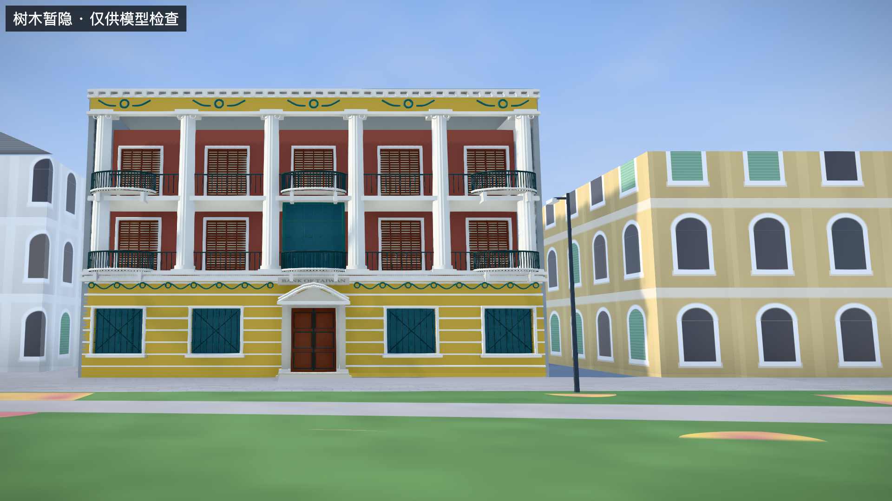
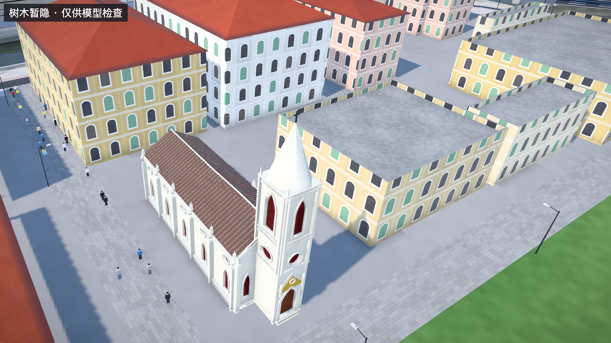

# P3：银行檐带与教堂窗组修正

日期：2026-09-25。沿用已有照片，继续修正B1/B3；没有新增外部数据或扩大建筑数量。

## 本批结果

- 台湾银行旧址：补充首层绿色花环檐带，避开入口铭牌；主场景补回独立查看器中已有的英文铭牌标注。
- 露德圣母堂：钟塔及侧窗改用红棕百叶表达，叶片覆盖到尖拱上段，并随尖拱和圆窗边界收窄。
- 教堂院落侧：修复把五组窗压缩进约42%墙长的生成错误，沿用整面名义开间间距，仅截取前段两组窗。未知后段继续保持简化。

[银行主场景](http://localhost:5174/#scene=detail-bank) · [教堂主场景](http://localhost:5174/#scene=detail-lourdes) · [独立样件对照](http://localhost:5174/prototypes/p2/#B3)

截图为暂隐树木的检查视图，带有模式标记；实际默认场景保留树木。

## 依据与估计边界

照片与完整署名许可沿用 [P0逐张记录](research/p0-2026-09-25/photo-review.md)。

| 对象 | 本批采用的依据 | 仍有估计的部分 |
| --- | --- | --- |
| B1首层檐带 | B1-b（2021）可见花环、垂带与铭牌关系；B1-c/d作历史结构参考 | 左段可辨节奏；右段采用对称推定。花环间距、尺度与浮雕纹样不作精确还原声明 |
| B3百叶 | B3-a（2026）中的红棕色钟塔及侧窗；B3-b（2025）院落侧局部 | 叶片间距、厚度、色值与开合角度均未量测 |
| B3院落侧窗组 | 已有局部资料与整面开间网格共同约束 | 两组窗的间距属于模型推定，不代表整个东侧已测绘或其余窗户已核实 |

银行新檐带在证据着色中标为布局估计。主场景铭牌复用现有英文标注及位置，尚未完整复刻中文铭牌、字体与全部文字。

本批不调整B1的14.2m和B3的25.4m估计高度，不改变源轮廓；B2的文献檐高与柱廊继续保留。

## 修正方式

`shutters.js` 根据现有窗洞边界计算每根百叶片的安全宽度，同时检查其上下边缘。尖拱上段逐渐收窄，圆窗上下两端收窄，避免固定宽度条片穿入墙面。保留后方的关闭窗扇表达，不将有百叶误称为可贯穿室内的完全开放窗口。

`churchSide` 以整面墙的坐标生成开间，再按片段范围筛选；不再用更短的墙长重新生成五组窗。窗口、扶壁和线脚使用同一坐标范围，已修复的片段与未知后段衔接。

银行文字提取为共享 `sample-labels.js`，独立查看器与主场景调用相同的标注数据。主场景使用受光材质，资源释放包括其纹理；本轮只进行日间显示验收，未新增夜间性能声明。

## 验证

- 全套41项测试通过，0失败、0跳过。
- 铭牌接入后，资源生命周期与样件相关10项复验通过。
- 新增射线回归：百叶各角点位于真实窗洞内；院落侧多余窗口位置恢复实墙，正确前窗保留；高处百叶存在；新花环避开铭牌。
- 独立查看器已观察教堂转角、院落侧两组窗与未知后段，以及银行檐带。
- 主场景已检查银行铭牌与教堂百叶，检查日志无error/warn，完成后恢复树木。
- 四个基础城市数据文件与既有基线一致；三栋平面控制点配准继续通过。
- B1主体约41,362三角形，B3约73,065三角形，不含文字平面与重复阴影绘制。这不是帧率或跨设备性能基准。

[结构化验证记录](research/p3-b1-b3-details/validation.json)

完整背面、独立高度/高程、精确构件尺寸和同期完整外观仍未完成，本批不能视为测绘级1:1验收。
