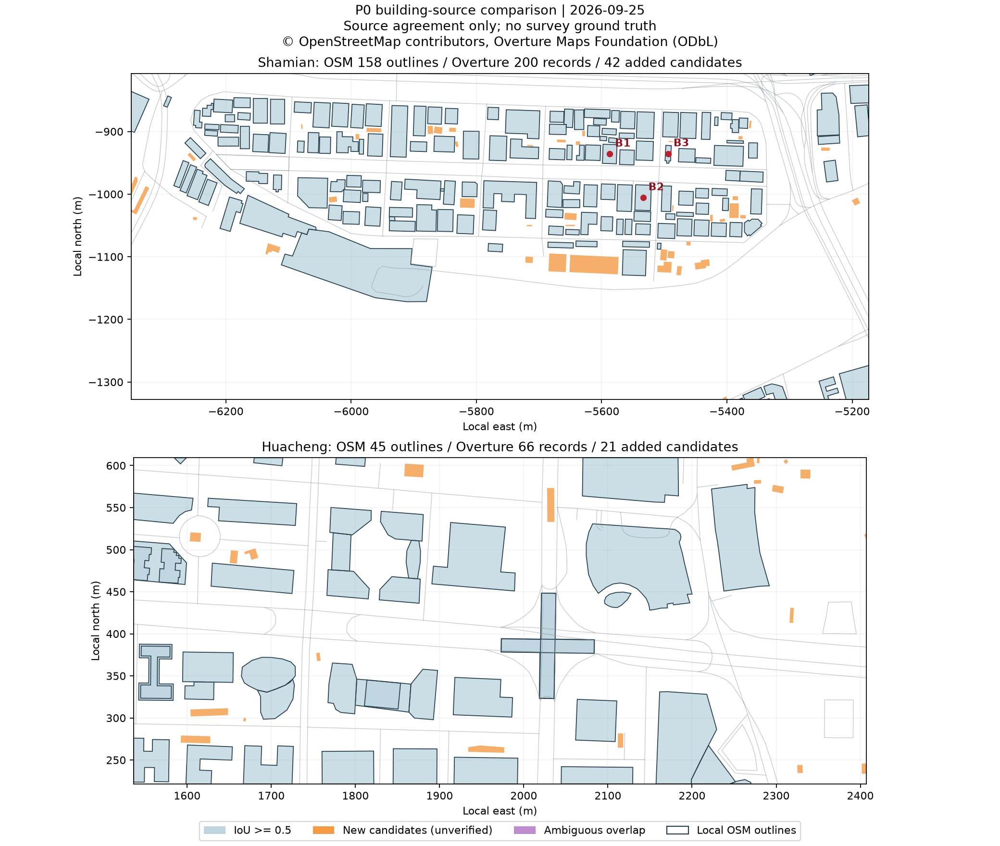
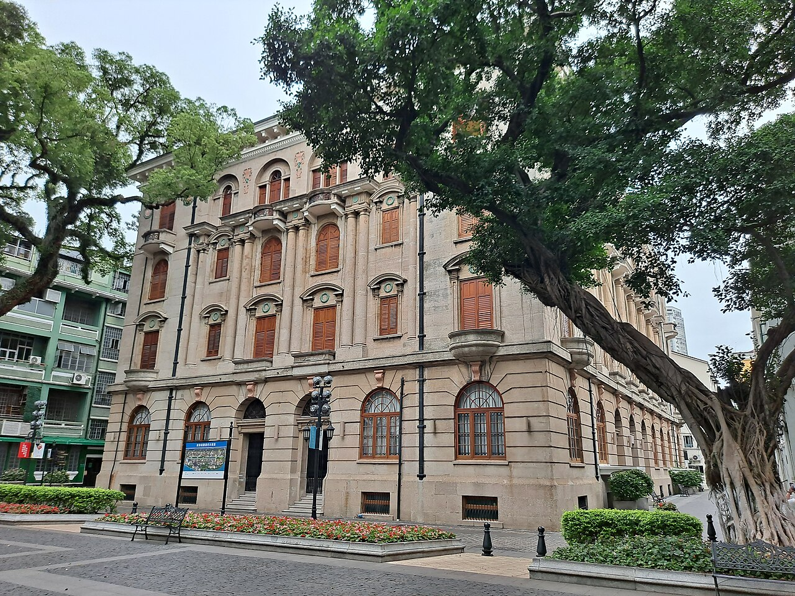
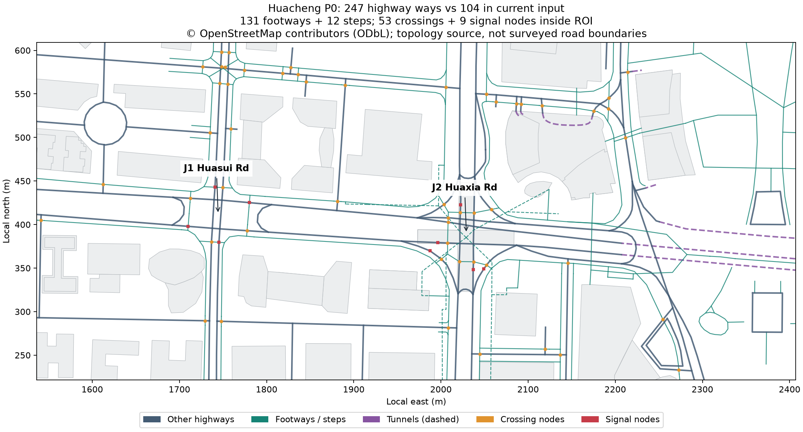

# P0：免费公开数据可行性核查

日期：2026-09-25。对应 [高精度还原方案](../../建筑与道路高精度还原方案-2026-09-25.md) 的 P0。

**P0 调查已完成。结论是有限范围可行：可以推进真实轮廓补充、道路拓扑补齐，以及三栋建筑的有证据临街立面样件；不能据此承诺整栋四面或道路尺寸的 1:1 还原。** 本阶段未进入 P1，没有改产品代码或 `data/` 城市产物。

## 1. 核心发现

1. Overture 在两个样区增加了 **63 个候选轮廓**，但 **新增高度为 0**。新增轮廓仍需排除误识别、年份变化与屋顶/地面边界差异，不能直接称为 63 栋核实建筑。
2. 完整 OSM 道路样区有 **247 条 highway way**，本地采集只有 **104 条**。差额恰好为 **131 条 footway 和 12 条 steps**；这是现有采集范围可改善的明确证据。
3. 完整样区还取得 **11 条转向限制**，各关系成员均在下载结果中；框内有 **53 个 crossing 节点、9 个 traffic_signals 节点**。节点数不是独立斑马线条数或信号灯实物数量。
4. 已核查 **127 张照片元数据，目视检查 12 张**。其中 8 张支撑三栋建筑的局部外观；4 张道路候选中有一张主要拍高楼，已排除作为道路结构证据。
5. 三栋建筑均缺独立实测高度，两个道路样区交叉口也缺宽度、缘石高差及高程。没有条件计算地理真实性的 RMSE 或宣称分米级精度。
6. 当前投影与以相同原点建立的 WGS84 局部等距投影存在米级数值差异。**这是两种坐标变换的差异，不是已测得的模型对现实误差。**

## 2. 样区与方法

| 样区 | WGS84 边界，西/南/东/北 | 约面积 | 用途 |
| --- | --- | ---: | --- |
| 沙面 | 113.234 / 23.1065 / 113.2455 / 23.1112 | 0.6132 km² | 建筑轮廓与立面资料核查；矩形包含部分水面及岛外边缘 |
| 花城大道 | 113.311 / 23.1205 / 113.3195 / 23.124 | 0.3375 km² | 华穗路、华夏路附近道路和建筑；并非整条花城大道 |

本地 OSM 快照：道路时间戳为 2026-09-23T22:20:37Z；建筑各输入时间戳保存在 `source-samples/osm-buildings.json`。Overture 固定到 **2026-09-23.0** 版本。完整道路样区于本轮通过 OSM 官方 map API 获取，下载时间及文件哈希见 `source-manifest.json`。

计数以与矩形相交的源要素为单位；面积对矩形裁剪后取多边形并集。OSM `building` 外轮廓与 `building:part` 分开统计，不把部件当成多栋楼。本次未下载 Overture 的 building_part 主题，不评价其部件增益。

匹配规则：Overture 要素与本地 OSM 外轮廓的最大 IoU ≥ 0.5 列为匹配；与全部本地外轮廓并集的重叠面积占自身面积 < 0.1 列为新增候选，其余列为歧义。所有原始坐标保留，分析采用 WGS84 局部 AEQD 米制投影。参数及完整 WKT 见 `summary.json`。

这是可复查的资料比较，不是用一个预测数据集验证另一个数据集准确。两个样区合计不足 1 km²，不能外推全城新增建筑数量。

## 3. 建筑数据比较

| 指标 | 沙面 | 花城大道样区 |
| --- | ---: | ---: |
| 本地 OSM 建筑外轮廓 | 158 | 45 |
| 本地 OSM 建筑部件 | 11 | 7 |
| Overture 建筑记录 | 200 | 66 |
| 匹配现有外轮廓 | 158 | 45 |
| 新增候选轮廓 | 42 | 21 |
| 歧义重叠记录 | 0 | 0 |
| OSM 轮廓并集面积 | 110,575.77 m² | 87,856.37 m² |
| Overture 超出现有并集面积 | 7,114.53 m² | 2,910.78 m² |
| 相对现有并集的增加 | 约 6.4% | 约 3.3% |
| 新增候选面积中位数 | 67.3 m² | 115.9 m² |
| 新增候选中小于 100 m² | 24 / 42 | 8 / 21 |
| OSM / Overture 带 height | 0 / 0 | 6 / 6 |
| OSM / Overture 带楼层数 | 73 / 73 | 26 / 26 |
| 新增候选中带 height | 0 | 0 |

本次 Overture 的 203 个匹配对象来自 OpenStreetMap，63 个新增候选来自 East Asian Buildings（DOI:10.5281/zenodo.8174931），没有发现 Microsoft 或其他来源贡献的新增记录。因此样区结果不支持“接入 Overture 就能解决高度问题”。



图中深色边框为本地 OSM 外轮廓，浅蓝为匹配记录，橙色为待核实新增候选。橙色并不代表已查证准确的建筑。B1–B3 是下节样件。

证据：`shamian-building-comparison.csv`、`huacheng-building-comparison.csv`、对应 GeoJSON、`overture-provenance.json`。

**数据使用建议：** P1 先建立候选导入和人工确认机制，再用确认后的新增对象替换填充体块；已有 OSM 轮廓不用重复导入。不要因候选更密集就推断其更准确，也不要为没有高度的新增对象挂上“真实高度”标记。

## 4. 三栋建筑样件

本轮将首批精细对象收敛到沙面东部。三个对象集中在沙面大街 26 号、沙面一街 3 号、沙面大街 14 号附近，适合先制作离散样件，暂不承诺一整条连续街道都已具备素材。

| 样件 | 身份与 OSM ID | 已有依据 | 主要缺口 | P0 判断 |
| --- | --- | --- | --- | --- |
| B1 台湾银行广州支行旧址 | 沙面大街 26 号；w352610322 | 门牌和银行名称能在照片中核对；入口、黄色首层、窗栏、上层柱廊、弧形阳台；OSM 3 层 | 2021照片主要覆盖首层及入口；较完整柱廊照片为2012/2016年；背面、屋顶、精确柱距和高度缺证 | 可做临街入口/柱廊样件，不能称整栋复原 |
| B2 沙面一街3号 | w352610258；Commons 分类为 Banque de l'Indochine Building | 2023主立面和转角侧面；拱窗、百叶、壁柱、阳台与基座；OSM 4 层 | OSM 名称为“东风汇理银行旧址”，与常用“东方汇理银行”存在文字差异，暂以地址和源ID绑定；背面与屋顶缺证 | 可做主立面和转角样件，名称规范化应保留别名证据 |
| B3 露德圣母堂 | 沙面大街 14 号；w392765468 | 2026照片可见主入口、钟塔、一侧长墙和局部屋面；2025照片补院落侧局部；OSM 有 gabled 屋顶标签 | OSM 仅标1层，不能代表钟塔高度；背面、塔高、屋顶坡度无量测；附属建筑需分开归属 | 可做辨识度强的单体样件，塔楼需独立表达并标估计高度 |



图片：Inclavatura，2023-04-25，[沙面一街3号](https://commons.wikimedia.org/wiki/File:%E6%B2%99%E9%9D%A2%E4%B8%80%E8%A1%973%E5%8F%B7.jpg)，[CC BY-SA 4.0](https://creativecommons.org/licenses/by-sa/4.0/)。此处使用 Commons 提供的预览版本，未改图。

### 4.1 逐面证据结论

- B1：临街面部分可见；两个侧面、背面、完整屋顶均未满足核验条件。
- B2：主立面和一个转角侧面部分可见；其余侧面、背面、屋顶未满足条件。
- B3：主入口、一侧长墙、另一侧院落局部及部分屋顶可见；背面未知。2025与2026资料分开标记，不混称同一时期全覆盖。

`facade-evidence.csv` 共15项（每栋四个立面加屋顶）逐项列出照片ID、能识别的结构和未知项。本轮没有足够的真实外墙面积来计算“已还原面积百分比”，因此没有用照片张数或可见面数伪造覆盖率。

详细资料见 [逐张照片目视记录](photo-review.md)、`building-samples.csv`、`selected-photos.json`。坐标与轮廓面积是源数据值，不是实测值。

### 4.2 已发现的时相冲突

- B2 的2012与2023照片中，百叶/门窗颜色存在可见差异。2023照片作为该样件可见部位的颜色依据，旧照仅辅助结构，不混合烘焙。
- B1 上层更完整的参考比2021入口照片早数年，不能证明上层在2021或2026保持不变。
- B3 2025院落照包含邻楼、附属体量、植被和车辆；不能把它们全部合入教堂实体。

因此三个样件应各自保留参考年份。P0 并未建立“全场景2026年同期复原”的证据。

## 5. 道路样板

推荐优先验证两个实际节点区：

| 节点区 | 约中心 WGS84 | 可验证的结构 |
| --- | --- | --- |
| J1 花城大道 × 华穗路 | 113.31303, 23.12222 | 分向道路、过街连接、信号节点；含以整条 way 作为 via 的禁止掉头关系 |
| J2 花城大道 × 华夏路 | 113.31581, 23.12202 | 主路与连接道、人行/地下连接、仅可直行等限制；需要分层与不同交通方式的语义 |

这些中心点用于定位一个路口区域，不代表实测路口中心。连接两处路口及必要进口道形成第一段样板，长度在 P1 按选定中心线确定，不把多股道路长度之和当作走廊长度。



### 5.1 已取得的数据

| 指标 | 本地采集 | 完整样区 API |
| --- | ---: | ---: |
| 相交 highway way | 104 | 247 |
| 额外 footway / steps | 未采集这两类 | 131 / 12 |
| 带 lanes 的 way | 9 | 9 |
| 带 width 的 way | 0 | 0 |
| 带 turn:lanes 的 way | 0 | 0 |
| 带 sidewalk / cycleway 的 way | 3 / 0 | 3 / 0 |
| 带 incline / ele 的 way | 本轮原始盘点未作该项对比 | 9 / 0 |
| 转向限制 | 当前采集未包含 | 11条，成员引用全部存在 |
| 框内 crossing / traffic_signals 节点 | 当前道路采集未包含 | 53 / 9 |

实时 map API 会带回跨越边界的完整 way 及其节点。图表中的点要素计数严格限于矩形内；不要使用整个响应的73个crossing、13个traffic_signals当作框内统计。

本地样区有9条带 tunnel 标签的道路 way。当前构建会排除大多数隧道路段；应恢复连接及洞口表达，但不能把所有地下人行线都作为地面标线来绘制。

11条限制分别包含禁止右转、禁止直行、仅可直行、禁止掉头。**J1的4条禁止掉头关系使用 via-way，而非 via-node**：未来数据结构必须兼容这两种情况。完整成员列表保存于 `huacheng-restrictions.json`；路口节点见 `huacheng-junction-nodes.csv`。

### 5.2 图像和外部事实核对

已查看的 R3 照片含明确华穗路南/北方向路牌、转向指示、路缘和护柱，可作为2024年局部交通组织的观察证据。R4 能交叉确认地点。R1 是珠江西路附近的过街环境，精确拍摄方位未标定，不能直接挪用到 J2。R2 主要是高楼，已排除作为道路结构证据。

这些照片的许可均为 CC0，逐张出处、作者、时间、坐标见 `selected-photos.json`。**照片坐标是相机位置元数据，可能不精确，不是地面控制点。**

[天河区2026年答复](https://www.thnet.gov.cn/zfxxgkml/content/post_10846532.html)提到近年的节点治理和新中轴相关道路改造。这支持“旧照片存在时效风险”的判断，但该文不提供本样区可直接建模的现状横断面或标线施工图。

### 5.3 道路通过与不通过的部分

**通过：** 路口身份、节点/way连接、行人路径类别、桥隧分层标签和部分转向限制已有可追溯数据；可以做道路结构原型。

**不通过：** 道路边界的实测位置、逐车道宽度、车道渐变长度、缘石高度、横坡、隧道高程及全部当前标线。0个width、0个ele说明不能由此次下载直接解决这些问题；不能用常用设计尺寸替代现场尺寸后称为1:1。

## 6. 坐标与精度边界

保留 OSM/Overture 原始经纬度，按 WGS84、经度在前/纬度在后解释；样区 GeoJSON 未转换成地图偏移坐标。照片相机坐标只用于关联线索。

分析米制坐标使用以 113.296E、23.1185N 为中心的 WGS84 AEQD。本轮比较现有固定经纬度比例投影和该投影，每个区域均取11×11网格点：

| 范围 | 坐标差 RMS | 最大坐标差 |
| --- | ---: | ---: |
| 沙面样区 | 3.563 m | 4.063 m |
| 花城大道样区 | 0.971 m | 1.210 m |
| 项目全范围矩形 | 3.200 m | 7.045 m |

该差异受原点、投影形变和近似公式影响，不能解释为建筑错位了上述距离。P1 若引入外部米制资产，应该统一变换并用本地控制点做配准检查，而不是直接把新坐标混入旧坐标或整体平移猜位置。

**允许的精度声明：** 与所选源数据一致；某些可见立面结构由指定照片支持；某些道路连接由OSM关系支持。

**不允许的精度声明：** 全栋四面1:1、道路实测1:1、统一2026年现状、厘米/分米级位置或尺寸准确度。本轮没有独立控制点、测绘图、精确楼高或可靠道路高程。

## 7. 来源、许可与版本

| 来源 | 使用范围 | 使用/再发布条件与处理 |
| --- | --- | --- |
| 本地OSM与官方map API | 建筑、道路、节点、限制关系 | ODbL；保留 OpenStreetMap 贡献者署名，样区派生数据库继续按 ODbL 管理 |
| Overture 2026-09-23.0 | 两个建筑样区 | 建筑主题ODbL；保留 Overture 与底层来源署名 |
| East Asian Buildings | 经Overture获得的63个候选 | Overture官方署名页列 Qian Shi 等，DOI:10.5281/zenodo.8174931，CC BY 4.0；逐记录license为空时不得据此认为无许可限制 |
| Commons照片 | 12张本地预览，127张元数据 | 有CC BY 2.5、CC BY-SA 3.0/4.0、CC0等；逐张许可见记录，不能给整个图片目录统一套代码MIT许可 |
| 政府网页 | 地点/时效性参考 | 本轮只链接事实参考，没有把网页图片复制为模型纹理 |

依据：[OSM版权说明](https://www.openstreetmap.org/copyright)、[Overture署名与许可](https://docs.overturemaps.org/attribution/)、各照片独立说明页。代码、派生地理数据库和照片各自保留许可边界。

下载日期、源数据版本、源记录update_time和照片DateTimeOriginal分开保存。Overture里出现的2024-11-01等来源版本日期不能当作卫星拍摄日期。

## 8. 获取过程中的问题与处理

### Overture客户端误报无数据

使用官方 `overturemaps==1.0.2` 对两个样区下载时均返回“No data found”。检查2026-09-23.0的 `collections.parquet` 后发现：1123行的collection字段全部为null，而客户端以collection等于building过滤。

已在研究脚本里改用索引资产路径中明确的 `theme=buildings/type=building/` 与空间边界筛选；每个样区仅涉及一个候选Parquet文件，然后按行级bbox过滤并检查实际几何。成功取得200/66条记录。没有修改安装包或产品代码。

### Commons限流

初次批量元数据请求遇到429。后续复用缓存、降低请求频率，取得118张基础候选元数据，再有针对性补充9张道路候选，最终127张。没有把全部照片下载为纹理，也没有调用付费图像服务。

### Overpass超时

两个测试入口分别出现504和超时。改用官方小范围 map API，成功取得2587个要素、约743KB响应。该响应保留节点与关系成员。原始Overpass查询仍留档，但不是本轮成功证据来源。

一份政府规划PDF仅取得目录/部分索引，后续读取超时，没有将搜索摘要中的尺寸或地址作为最终量测证据。

## 9. P0门槛核对与下一阶段范围

| P0要求 | 结果 |
| --- | --- |
| 样区建筑裁剪与对比 | 完成；两个固定样区、逐对象CSV、GeoJSON及覆盖图 |
| 至少3栋可制作样件 | 条件满足：能制作有证据的临街外观，未满足四面完整复原 |
| 逐栋/逐面照片清单 | 完成；3栋、15个立面/屋顶项、12张目视记录，未知项显式保留 |
| 可核对的道路/路口 | 条件满足：J1/J2拓扑及局部视觉资料可用，精确横断面未满足 |
| 坐标、许可、时相记录 | 完成；没有将拍摄时间与下载/发布版本混同 |
| 精度承诺边界 | 完成；绝对精度及同期全覆盖均不通过 |

**建议 P1 的实际优先级：**

1. 稳定源ID、字段来源/日期/可信度、building与part关系；保留既有源轮廓。
2. 把真实人行线、台阶、过街节点及restriction接入道路数据结构，支持via-node与via-way、不同交通方式和地下连接。
3. 加入63个轮廓的“候选→人工确认→替换填充”机制；本轮不授权将候选自动当真。
4. 建立三栋样件的逐面数据入口，未核实面继续低细节表达，移除随机参数对已核实面的覆盖。
5. 高度、道路断面继续保留estimated/unknown状态。数据缺口不靠AI生成或模板尺寸伪装成事实。

与原方案相比，P0把“连续300–500m精细建筑街段”的首批目标收敛为沙面东部三个有证据对象；道路首批明确为华穗路/华夏路两个节点区。该调整是依据免费素材覆盖提出的下一阶段建议，本轮没有实施产品变更。

## 10. 文件与复现

- `summary.json`：全部计算指标。
- `building-coverage.png` / `road-evidence.png`：已目视检查的比较图。
- `building-samples.csv` / `facade-evidence.csv`：样件与逐面清单。
- `photo-review.md` / `photo-inventory.csv` / `selected-photos.json`：照片核查、来源、许可和本地文件哈希。
- `*-building-comparison.csv` / `*-buildings.geojson`：逐建筑匹配与源几何。
- `huacheng-road-inventory.csv` / `huacheng-full-highways.geojson` / `huacheng-restrictions.json` / `huacheng-junction-nodes.csv`：道路证据。
- `source-samples/`：复算所需的小范围源快照；不依赖全城重新下载。
- `source-manifest.json` / `validation.json`：输入与产物哈希、来源、获取时间和检查结果。
- `collect_sources.py` / `collect_overture.py` / `analyze.py` / `review_evidence.py`：独立研究脚本；不在应用运行链路中。

本次研究依赖安装在被git忽略的 `.research/p0-2026-09-25/.venv`，未改项目 package.json 或全局Python环境。复算命令（在项目根目录）：

```bash
.research/p0-2026-09-25/.venv/bin/python docs/research/p0-2026-09-25/analyze.py
```

另一个环境可用 `requirements.txt` 建立隔离环境后运行同一脚本；所需固定输入在source-samples中。`review_evidence.py`根据已检查的照片清单生成说明，不会自动识别照片内容。重新下载会受到源服务后续修改、限流和网络状态影响，重现本轮数值应使用已保存快照。
