# P0 照片证据与逐张目视记录

日期：2026-09-25。共检索127张照片的元数据，以下12张已下载并目视核查。目录收录不等于照片可用于建模。
本目录保存 Commons 提供的预览文件，未改图、未进行AI补全。原图和文件说明页见每张图片的链接。使用时保留署名、许可和原始来源；不把人物、车辆与阴影当作固定立面。

## B1-a

已目视：银行名称、26号门牌、门头山花、石材线脚和木门清楚。仅入口局部，不能证明整面开间或楼高。人物不应烘焙进立面。

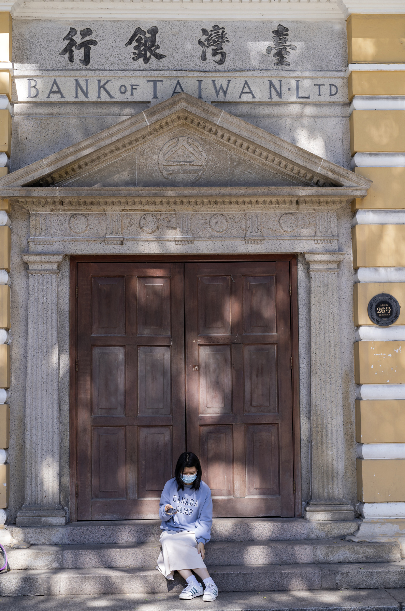

来源：[File:Former Guangzhou Sub-branch, Bank of Taiwan 20211114.jpg](https://commons.wikimedia.org/wiki/File:Former_Guangzhou_Sub-branch,_Bank_of_Taiwan_20211114.jpg)；作者：方人也；拍摄时间字段：Taken on 14 November 2021 12:26:59；许可：[CC BY 2.5](https://creativecommons.org/licenses/by/2.5)。

## B1-b

已目视：2021年的首层开间、窗栏、横向墙缝与上层柱廊局部；树干和行人遮挡，顶部未完整入镜。

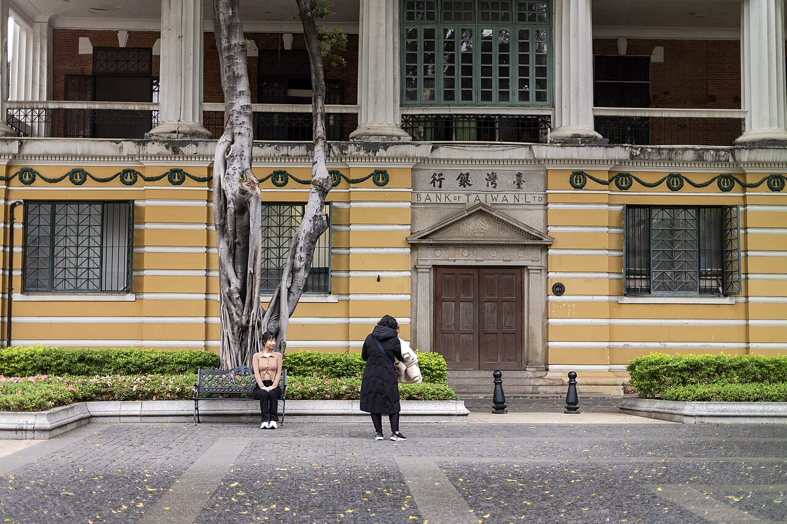

来源：[File:Former Guangzhou Sub-branch, Bank of Taiwan 20211226.jpg](https://commons.wikimedia.org/wiki/File:Former_Guangzhou_Sub-branch,_Bank_of_Taiwan_20211226.jpg)；作者：方人也；拍摄时间字段：Taken on 26 December 2021 14:28:27；许可：[CC BY 2.5](https://creativecommons.org/licenses/by/2.5)。

## B1-c

已目视：2012年同一临街立面；可辅助理解柱廊和开间连续性。仅历史结构参考，不能代替2021/2026现状。

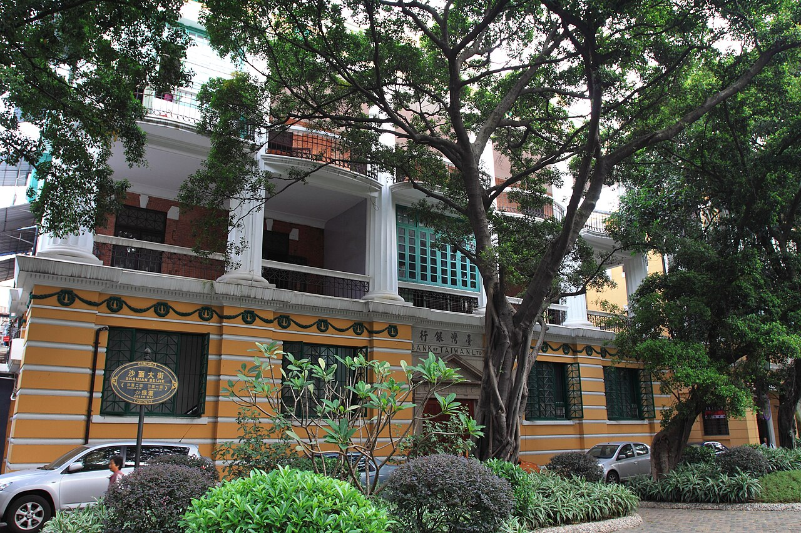

来源：[File:Guangzhou Shamian 2012.11.15 10-02-58.jpg](https://commons.wikimedia.org/wiki/File:Guangzhou_Shamian_2012.11.15_10-02-58.jpg)；作者：Zhangzhugang；拍摄时间字段：Taken on 15 November 2012 10:02:58；许可：[CC BY-SA 3.0](https://creativecommons.org/licenses/by-sa/3.0)。

## B2-a

已目视：2023年临街主立面及相邻转角侧面，拱窗、百叶、壁柱、阳台和基座可辨；屋顶与局部侧面被树冠遮挡。

来源：[File:沙面一街3号.jpg](https://commons.wikimedia.org/wiki/File:%E6%B2%99%E9%9D%A2%E4%B8%80%E8%A1%973%E5%8F%B7.jpg)；作者：Inclavatura；拍摄时间字段：2023-04-25；许可：[CC BY-SA 4.0](https://creativecommons.org/licenses/by-sa/4.0)。

## B2-b

已目视：2012年门窗与柱式细部。与2023年照片的百叶/门窗颜色不同，只用于旧有几何参考，不混作同一时期材质。

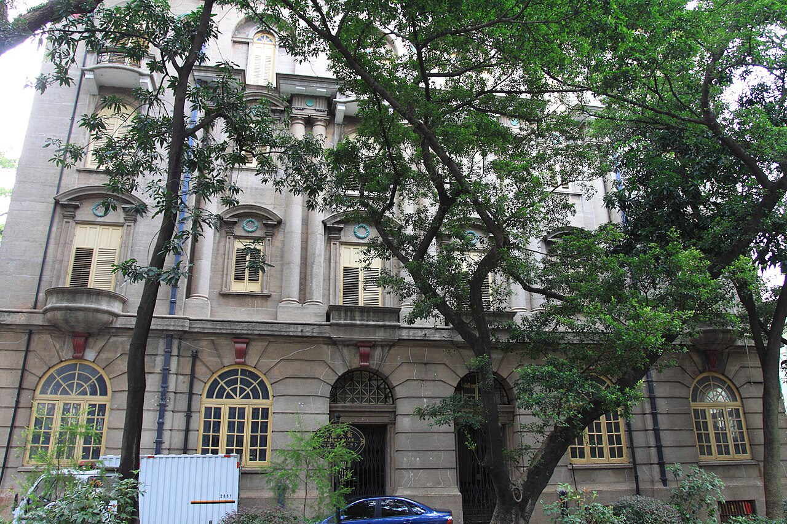

来源：[File:Guangzhou Shamian 2012.11.15 10-05-02.jpg](https://commons.wikimedia.org/wiki/File:Guangzhou_Shamian_2012.11.15_10-05-02.jpg)；作者：Zhangzhugang；拍摄时间字段：2012-11-15 10:05:02；许可：[CC BY-SA 3.0](https://creativecommons.org/licenses/by-sa/3.0)。

## B3-a

已目视：2026年主入口、钟塔、尖拱、圆窗及一侧长墙；局部屋面可见，另一侧与背面不能由此确认。

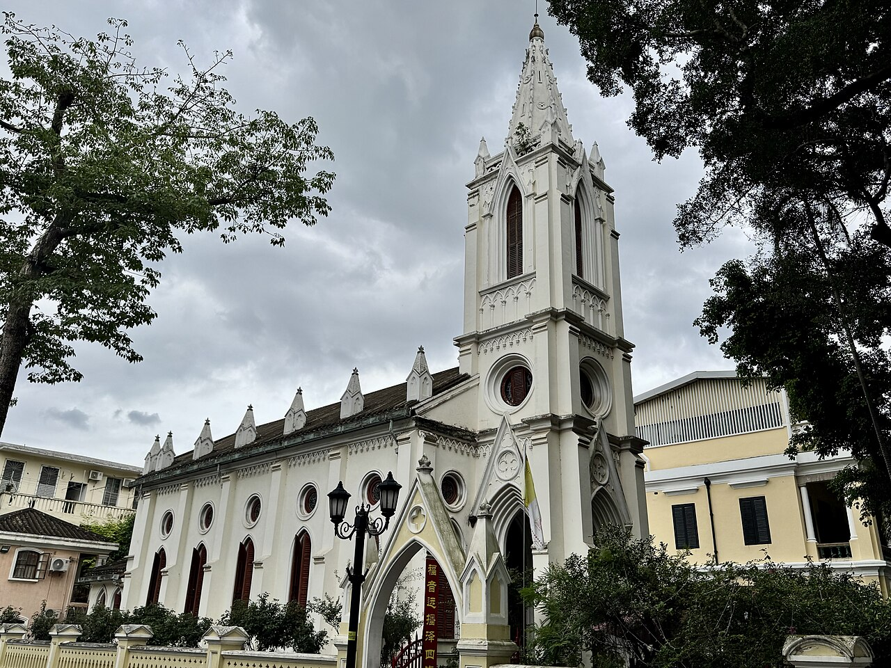

来源：[File:Our Lady of Lourdes Chapel, Shamian 20260518.jpg](https://commons.wikimedia.org/wiki/File:Our_Lady_of_Lourdes_Chapel,_Shamian_20260518.jpg)；作者：JULIANISME；拍摄时间字段：2026-05-18 14:21:14；许可：[CC BY-SA 4.0](https://creativecommons.org/licenses/by-sa/4.0)。

## B3-b

已目视：2025年另一侧院落，教堂侧墙局部、邻楼及院内附属体量；遮挡严重，不能把画面里所有楼都归入教堂轮廓。

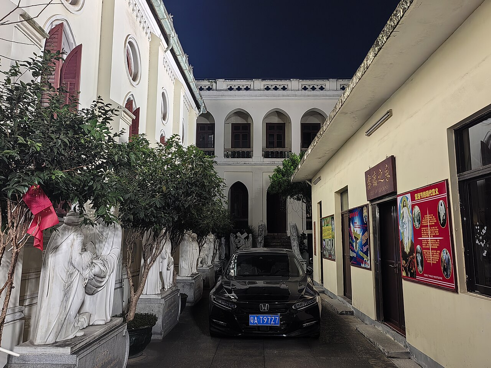

来源：[File:20251116 14 Shamian Dajie (182309).jpg](https://commons.wikimedia.org/wiki/File:20251116_14_Shamian_Dajie_(182309).jpg)；作者：Yumeto；拍摄时间字段：2025-11-16 18:23:09；许可：[CC BY-SA 4.0](https://creativecommons.org/licenses/by-sa/4.0)。

## B1-d

已目视：2016年斜向仰视的通高柱、弧形阳台、檐口。透视明显，有树遮挡，未显示背面；仅历史结构参考。

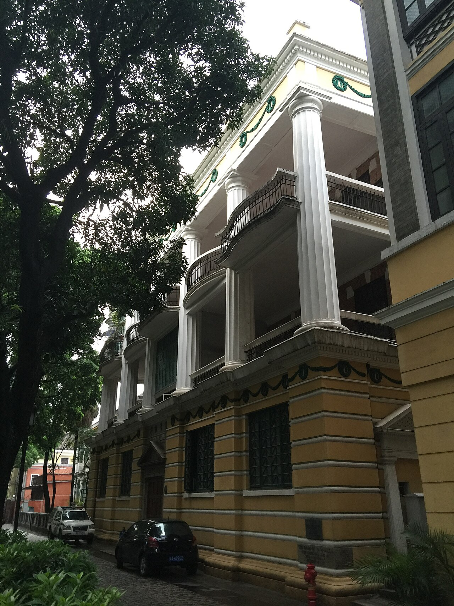

来源：[File:BankofTaiwan Shamian.jpg](https://commons.wikimedia.org/wiki/File:BankofTaiwan_Shamian.jpg)；作者：Boubloub；拍摄时间字段：Taken on 29 January 2016 17:56:16；许可：[CC0](http://creativecommons.org/publicdomain/zero/1.0/deed.en)。

## R1

已目视：街口斑马线、信号灯与邻近建筑可辨，车辆遮挡路面。元数据点在珠江西路附近；精确拍摄方位未标定，不作为华夏路路口量测图。

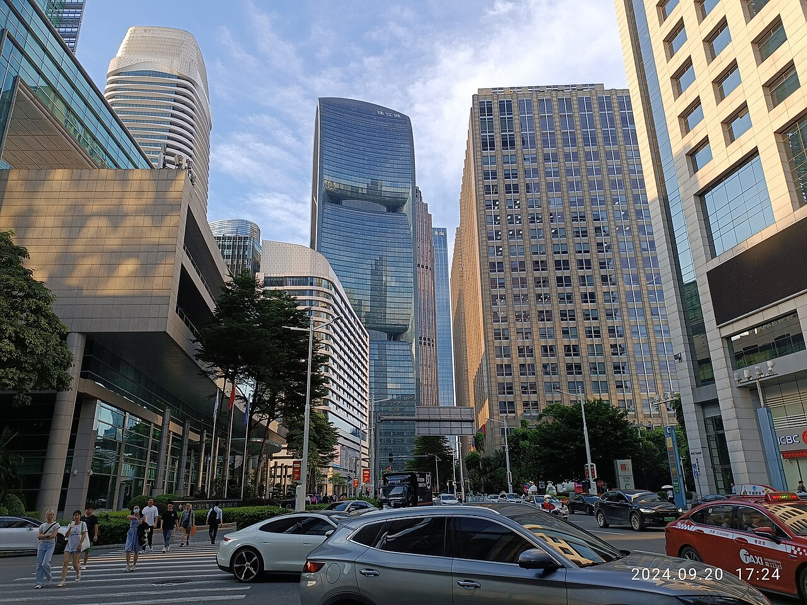

来源：[File:GD 廣東 Guangdong 廣州 Guangzhou 天河區 TianHe 花城大道 HuaCheng Avenue 珠江新城 ZhuJiang New Town September 2024 R12S 03.jpg](https://commons.wikimedia.org/wiki/File:GD_%E5%BB%A3%E6%9D%B1_Guangdong_%E5%BB%A3%E5%B7%9E_Guangzhou_%E5%A4%A9%E6%B2%B3%E5%8D%80_TianHe_%E8%8A%B1%E5%9F%8E%E5%A4%A7%E9%81%93_HuaCheng_Avenue_%E7%8F%A0%E6%B1%9F%E6%96%B0%E5%9F%8E_ZhuJiang_New_Town_September_2024_R12S_03.jpg)；作者：Ghaud Lnegauk；拍摄时间字段：2024-09-20 17:24:32；许可：[CC0](http://creativecommons.org/publicdomain/zero/1.0/deed.en)。

## R2

已目视：主要为IFC和周边高楼，路面基本不可见。排除作为道路结构证据，仅保留检索反例。

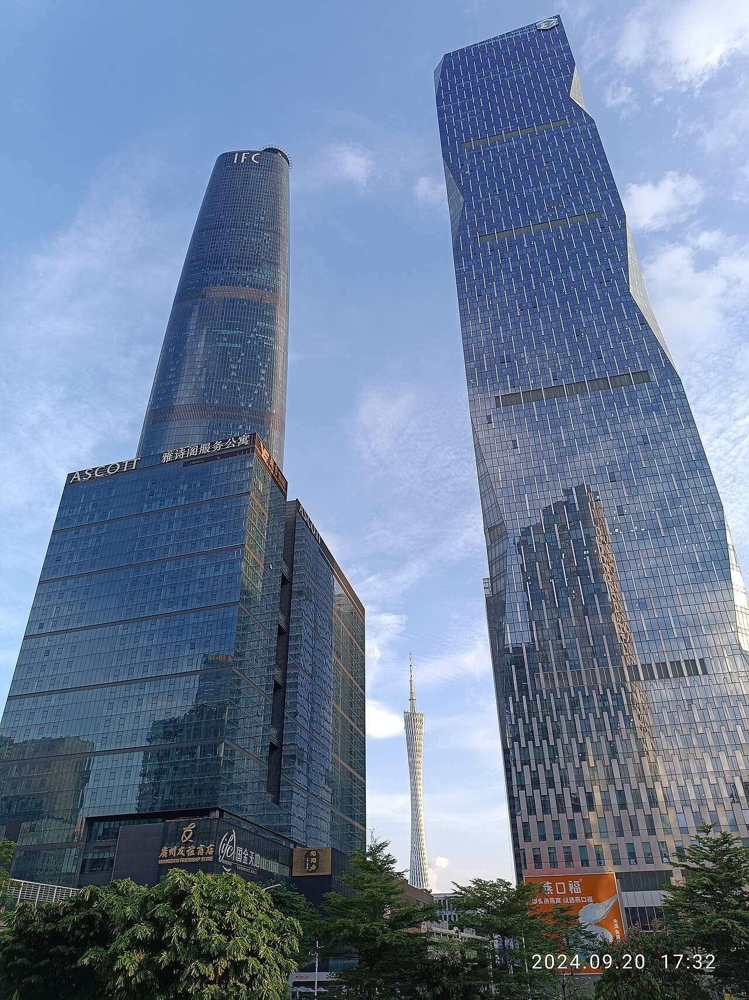

来源：[File:GD 廣東 Guangdong 廣州 Guangzhou 天河區 TianHe 花城大道 HuaCheng Avenue 珠江新城 ZhuJiang New Town September 2024 R12S 08.jpg](https://commons.wikimedia.org/wiki/File:GD_%E5%BB%A3%E6%9D%B1_Guangdong_%E5%BB%A3%E5%B7%9E_Guangzhou_%E5%A4%A9%E6%B2%B3%E5%8D%80_TianHe_%E8%8A%B1%E5%9F%8E%E5%A4%A7%E9%81%93_HuaCheng_Avenue_%E7%8F%A0%E6%B1%9F%E6%96%B0%E5%9F%8E_ZhuJiang_New_Town_September_2024_R12S_08.jpg)；作者：Ghaud Lnegauk；拍摄时间字段：2024-09-20 17:32:05；许可：[CC0](http://creativecommons.org/publicdomain/zero/1.0/deed.en)。

## R3

已目视：路牌明确指向华穗路南/北，存在掉头/左转、直行、右转导向；路缘及护柱可见。可佐证2024年该进口方向的交通组织，不能推算路宽，也不能当成2026现状确认。

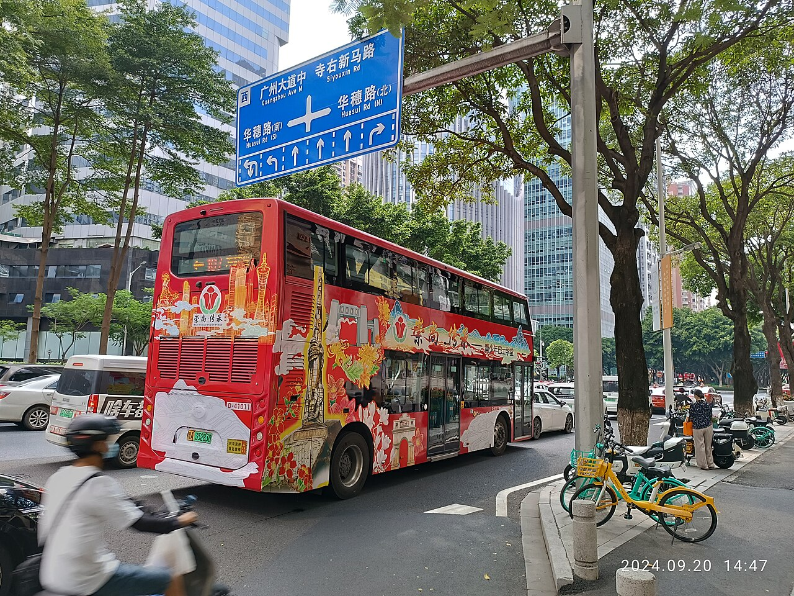

来源：[File:GD 廣東 Guangdong 廣州 Guangzhou 花城大道 HuaCheng Avenue 華穗路 HuaSui Road blue sign September 2024 R12S.jpg](https://commons.wikimedia.org/wiki/File:GD_%E5%BB%A3%E6%9D%B1_Guangdong_%E5%BB%A3%E5%B7%9E_Guangzhou_%E8%8A%B1%E5%9F%8E%E5%A4%A7%E9%81%93_HuaCheng_Avenue_%E8%8F%AF%E7%A9%97%E8%B7%AF_HuaSui_Road_blue_sign_September_2024_R12S.jpg)；作者：Ghaud Lnegauk；拍摄时间字段：2024-09-20 14:47:40；许可：[CC0](http://creativecommons.org/publicdomain/zero/1.0/deed.en)。

## R4

已目视：花城大道、华穗路等导向牌可辨。用于地点身份交叉核对；不能量测断面、车道数量或高程。

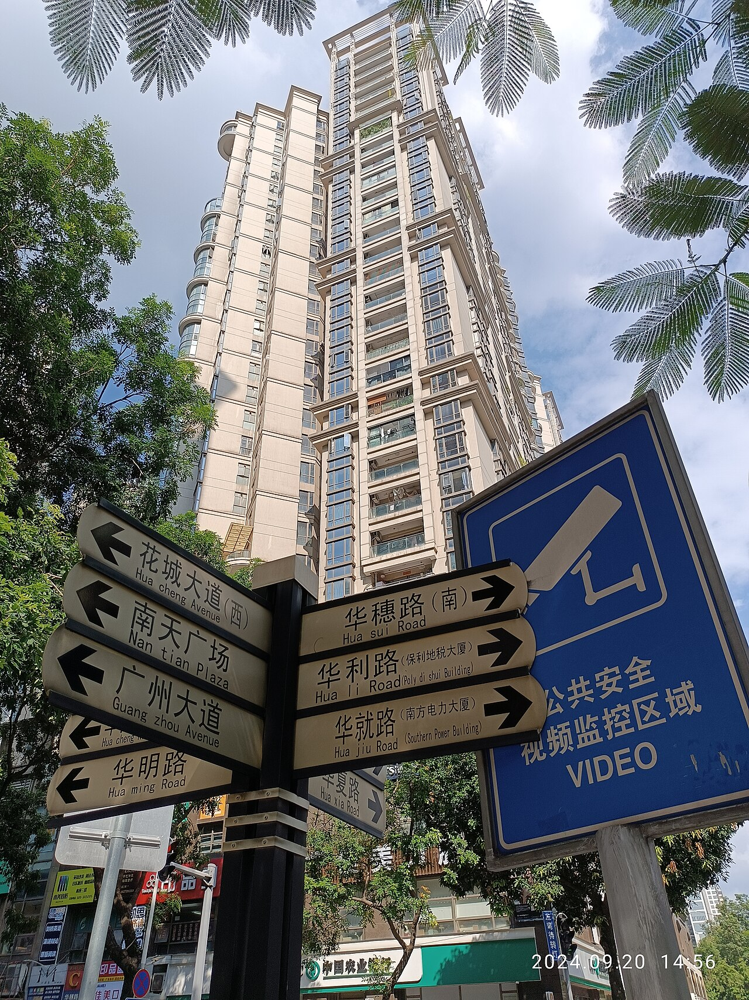

来源：[File:GD 廣東 Guangdong 廣州 Guangzhou 花城大道 HuaCheng Avenue 華穗路 HuaSui Road directory sign September 2024 R12S.jpg](https://commons.wikimedia.org/wiki/File:GD_%E5%BB%A3%E6%9D%B1_Guangdong_%E5%BB%A3%E5%B7%9E_Guangzhou_%E8%8A%B1%E5%9F%8E%E5%A4%A7%E9%81%93_HuaCheng_Avenue_%E8%8F%AF%E7%A9%97%E8%B7%AF_HuaSui_Road_directory_sign_September_2024_R12S.jpg)；作者：Ghaud Lnegauk；拍摄时间字段：2024-09-20 14:56:47；许可：[CC0](http://creativecommons.org/publicdomain/zero/1.0/deed.en)。
